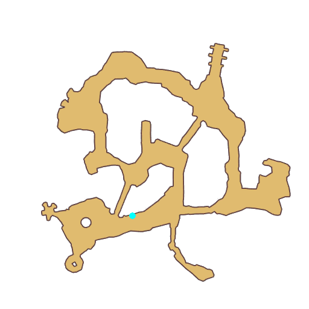
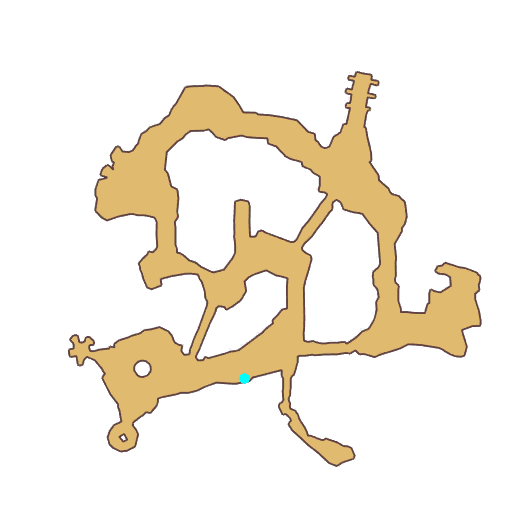

# Quest Underwater Cave, Byalan

- Id: 100004
- Steps: 8
- Map: 11, 10
- Next quest: [Byalan, Underwater Cave](100005.md)
- Previous quest: [Byalan](100003.md)

## Steps

### Step 0
- StepName:  Rescue Explorers
- Map:  11
- Trace:  
- Type:  branch
- Content:  move

### Step 6
- StepName:  Rescue Explorers
- Map:  11
- Trace:  
- Type:  branch
- Content:  visit
- Visit NPC 1310, Wounded expedition team member

- 
- Dialog: (96741)There's a wounded expedition member here!  - Options: Provide help

### Step 11
- StepName:  Rescue Explorers
- Map:  11
- Trace:  
- Type:  branch
- Content:  visit
- Visit NPC 1309, Wounded expedition team member

- 
- Dialog: (96742)There's a wounded expedition member here!  - Options: Provide help

### Step 16
- StepName:  Rescue Explorers
- Map:  11
- Trace:  
- Type:  branch
- Content:  visit
- Visit NPC 1311, Wounded expedition team member

- 
- Dialog: (96743)There's a wounded expedition member here!  - Options: Provide help

### Step 21
- StepName:  Rescue Explorers
- Map:  11
- Trace:  
- Type:  branch
- Content:  visit
- Visit NPC 1312, Wounded expedition team member

- 
- Dialog: (96744)There's a wounded expedition member here!  - Options: Provide help

### Step 26
- StepName:  Rescue Explorers
- Map:  11
- Trace:  
- Type:  branch
- Content:  visit
- Visit NPC 1308, Wounded expedition team member

- 
- Dialog: (96744)There's a wounded expedition member here!  - Options: Provide help

### Step 31
- StepName:  Rescue Explorers
- Map:  11
- Trace:  
- Type:  branch
- Content:  dialog
- Dialog: (96745)Whew, we finally managed to save all of the expedition team!

### Step 32
- StepName:  Rescue Explorers
- Map:  10
- Trace:  
- Type:  branch
- Content:  visit
- Visit NPC 1149, Davis

- Dialog: (96746)Thank you so much! I've arranged for my injured comrades to take Captain Karoo's boat back to Izlude for treatment.

