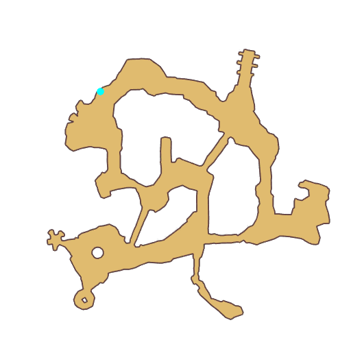

# Quest Underwater Cave

- Id: 100006
- Steps: 3
- Map: 11
- Previous quest: [Byalan, Underwater Cave](100005.md)

## Steps

### Step 0
- StepName:  Shining Shell
- Map:  11
- Trace:  
- Type:  branch
- Content:  visit
- Visit NPC 1157, Marrs

- 
- Dialog: (96752)I saw lots of [c][ffff00]Shining Shells[-][/c] in the distance. Could you help me collect some? - Options: Alright!

### Step 2
- StepName:  Shining Shell
- Map:  11
- Trace:  
- Type:  branch
- Content:  collect

### Step 4
- StepName:  Shining Shell
- Map:  11
- Trace:  
- Type:  branch
- Content:  visit
- Visit NPC 1157, Marrs

- 
- Dialog: (96753)Thank you! My kids love shiny things. I'm sure they will like these marine products! 

