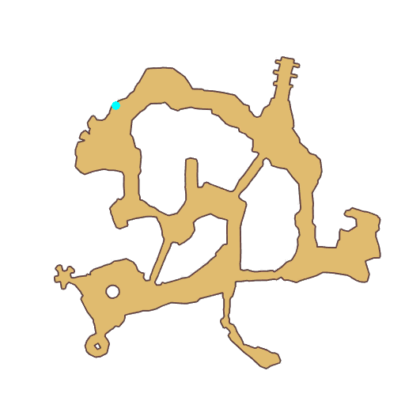

# Quest Underwater Cave

- Id: 100008
- Steps: 3
- Map: 11
- Previous quest: [Byalan, Underwater Cave](100005.md)

## Steps

### Step 0
- StepName:  Huge Plier
- Map:  11
- Trace:  
- Type:  branch
- Content:  visit
- Visit NPC 1157, Marrs

- 
- Dialog: (96756)I just saw some interesting [c][ffff00]Vadon Claws[-][/c]. I want to take some back as toys for my children. Could you help me collect some?  - Options: Alright!

### Step 1
- StepName:  Huge Plier
- Map:  11
- Trace:  
- Type:  branch
- Content:  gather

### Step 2
- StepName:  Huge Plier
- Map:  11
- Trace:  
- Type:  branch
- Content:  visit
- Visit NPC 1157, Marrs

- 
- Dialog: (96757)Thank you so much! If children put these claws on their hands, don't you think they would look like the legendary alien Baltan? 

