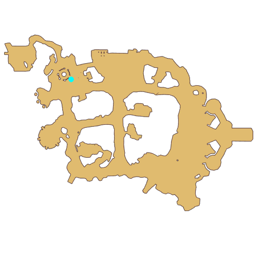

# Quest Novice

- Id: 10001
- Steps: 4
- Map: 2
- Next quest: [Novice](10100.md)
- Previous quest: [Novice](10101.md)

## Steps

### Step 1
- StepName:  New Arriver
- Map:  2
- Trace:  Go to Prontera South Gate
- Type:  acc_main
- Content:  move

### Step 2
- StepName:  New Arriver
- Map:  2
- Trace:  Go to Prontera South Gate
- Type:  acc_main
- Content:  guide

### Step 3
- StepName:  New Arriver
- Map:  2
- Trace:  Talk to [c][ffff00][npcName][-][/c]
- Type:  acc_main
- Content:  visit
- Visit NPC 1050, Cenia

- 

### Step 4
- StepName:  New Arriver
- Map:  2
- Trace:  
- Type:  acc_main
- Content:  dialog
- Dialog: (503541)[c][ffff00][PlayerName][-][/c], you finally come!
- Dialog: (503542)We said we would apply for the Eden Team together. I lined up first, and then he suddenly disappeared... - Options: Eden Team?
- Dialog: (503543)Yes! The first step of the Prontera adventure dream is to clear the test of [c][ffff00]Eden Team[-][/c]!
- Dialog: (503544)After all, it is dangerous for [c][ffff00][PlayerName][-][/c] to run around with no combat skills nor any weapons and equipment.
- Dialog: (503545)I heard Prontera is not safe as of late. We need to grow into a great adventurer quickly to protect our companions! - Options: OK
- Dialog: (503546)That's good... I registered for you before you arrived. We simply have to initiate the exam with Examiner Vivinne! - Options: Let's test now

