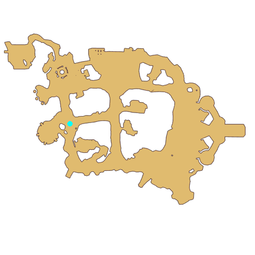

# Quest Trial 1

- Id: 10002
- Steps: 33
- Map: 2
- Next quest: [Trial 2](10003.md)
- Previous quest: [Novice](10100.md)

## Steps

### Step 5
- StepName:  Trial 1
- Map:  2
- Trace:  Look for Poi in the west
- Type:  acc_main
- Content:  move

### Step 6
- StepName:  Trial 1
- Map:  2
- Trace:  
- Type:  acc_main
- Content:  dialog
- Dialog: (503560)So you must be the newly admitted [c][ffff00][PlayerName][-][/c] and Cenia, I feel motivated just from seeing how energetic and enthusiastic you are! - Options: Tell me the situation.
- Dialog: (503561)Of course, I know! But if it was up to me, what's the point of mundane tests?
- Dialog: (503562)If it is a test, you have to be in the situation, making the candidate feel like they are helping an adventurer facing danger... That's right, just like that...
- Dialog: (503563)This examiner seems to enjoy chatting with himself?

### Step 13
- StepName:  Trial 1
- Map:  2
- Trace:  
- Type:  acc_main
- Content:  dialog
- Dialog: (503564)Huh? Did the examiner transform?!!!
- Dialog: (503565)Don't ruin the atmosphere, little girl! *Cough* Oh! Adventurers, I- I'm the prince of the Porings... Poi... Cursed by Demon King Morroc, I can only live on this piece of land at the South Gate... Poi...
- Dialog: (503830)Luckily, the curse can turn the Poring language I speak into human language... Poi... - Options: {What a pompous performance,2},{What a pity,3}

### Step 14
- StepName:  Trial 1
- Map:  2
- Trace:  
- Type:  acc_main
- Content:  dialog
- Dialog: (503566)Tsk, how is it pompous?! [c][ffff00][PlayerName][-][/c], I have faith you will defeat Morroc and save me from the Curse.

### Step 16
- StepName:  Trial 1
- Map:  2
- Trace:  
- Type:  acc_main
- Content:  dialog
- Dialog: (503568)Then let us start with the easiest Monster. Adventurer, defeat them with [c][ffff00]Auto Attack[-][/c]! Withered Branch... Summon the Monster!

### Step 18
- StepName:  Trial 1
- Map:  2
- Trace:  Use the Dead Branch
- Type:  acc_main
- Content:  use

### Step 35
- StepName:  Trial 1
- Map:  2
- Trace:  Use Auto Attack
- Type:  acc_main
- Content:  guide

### Step 36
- StepName:  Trial 1
- Map:  2
- Trace:  Defeat [num] [c][ffff00][monsterName][-][/c]
- Type:  acc_main
- Content:  kill

### Step 38
- StepName:  Trial 1
- Map:  2
- Trace:  Trial 1
- Type:  acc_main
- Content:  dialog
- Dialog: (503569)Nice one, Adventurer! Next, let me see if you really grasped the skill of Auto Attack! Withered Branch... Summon again!

### Step 46
- StepName:  Trial 1
- Map:  2
- Trace:  Defeat [num] [c][ffff00][monsterName][-][/c]
- Type:  acc_main
- Content:  kill

### Step 50
- StepName:  Trial 1
- Map:  2
- Trace:  
- Type:  acc_main
- Content:  dialog
- Dialog: (503570)Very well! Good job, you two! You can definitely help Poi to get rid of the Curse!
- Dialog: (503571)By the way, I remember there's a type of beautiful flower that can temporarily restore my appearance to that of a human. Can you help me [c][ffff00]Collect[-][/c] them please?
- Dialog: (503572)Collect?
- Dialog: (503573)Indeed, beautiful, delicate, and full of vitality. The Magical flowers grow not too far away from here. Help me collect a few! - Options: Off to pick flowers

### Step 53
- StepName:  Trial 1
- Map:  2
- Trace:  Collect [num] [c][ffff00][monsterName][-][/c]
- Type:  acc_main
- Content:  collect

### Step 54
- StepName:  Trial 1
- Map:  2
- Trace:  Give the flowers to Poi
- Type:  acc_main
- Content:  use

### Step 57
- StepName:  Trial 1
- Map:  2
- Trace:  
- Type:  acc_main
- Content:  dialog
- Dialog: (503575)Ah... A flower full of Magic Power, grant me strength!

### Step 62
- StepName:  Trial 1
- Map:  2
- Trace:  
- Type:  acc_main
- Content:  dialog
- Dialog: (503576)Well done, [c][ffff00][PlayerName][-][/c]! Even if it is only a temporary return to a human, I'm grateful!
- Dialog: (503818)These HP restoring potions are my thank you gift. Hopefully, they will help you in your adventure. Please accept them.

### Step 65
- StepName:  Trial 1
- Map:  2
- Trace:  
- Type:  acc_main
- Content:  dialog
- Dialog: (503577)Well done, [c][ffff00][PlayerName][-][/c]. I think it is time to score you and Cenia...
- Dialog: (503578)Examiner Poi, behind you...

### Step 67
- StepName:  Trial 1
- Map:  2
- Trace:  
- Type:  acc_main
- Content:  cutscene

### Step 69
- StepName:  Trial 1
- Map:  2
- Trace:  
- Type:  acc_main
- Content:  dialog
- Dialog: (503580)Examiner, Are you alright?! [c][ffff00][PlayerName][-][/c], we need to protect Examiner Poi, eliminate this awful creature quickly!
- Dialog: (503581)Don't move. Huge Porings are dangerous. You will have a hard time facing them now. You can use [c][ffff00]Thump[-][/c] to eliminate the danger!
- Dialog: (503582)Thump?
- Dialog: (503583)That's right, a very useful skill, the only way you can beat that Huge Poring is with this right now.

### Step 79
- StepName:  Trial 1
- Map:  2
- Trace:  Use Pound
- Type:  acc_main
- Content:  guide

### Step 80
- StepName:  Trial 1
- Map:  2
- Trace:  Defeat [c][ffff00][monsterName][-][/c]
- Type:  acc_main
- Content:  kill

### Step 86
- StepName:  Trial 1
- Map:  2
- Trace:  
- Type:  acc_main
- Content:  dialog
- Dialog: (503584)Wow! If we encounter another similar situation, Cenia wouldn't be scared!
- Dialog: (503585)Why did a Huge Poring appear suddenly? It shouldn't... - Options: What?
- Dialog: (503586)Huh? No... Nothing important. By the way, we need to formally congratulate the two of you...
- Dialog: (503587)You successfully passed! Here's the perfect report card for both of you. Please take it!

### Step 87
- StepName:  Trial 1
- Map:  2
- Trace:  Take the transcript from Poi
- Type:  acc_main
- Content:  use

### Step 97
- StepName:  Trial 1
- Map:  2
- Trace:  A new friend has something to say
- Type:  acc_main
- Content:  visit
- Visit NPC 803333, Headwear-loving Tony

- 

### Step 98
- StepName:  Trial 1
- Map:  2
- Trace:  
- Type:  acc_main
- Content:  dialog
- Dialog: (503589)Hey there! Congratulations on clearing the first round of the test! - Options: Even got full score
- Dialog: (503590)As a good companion of the Eden Team and an avid lover who has seen all Headwears across the world, I have prepared a huge gift for you two!
- Dialog: (503591)Look at your bare head. Do you always feel something missing?
- Dialog: (503592)Cute Headwear is well-liked by Adventurers. We Eden Team surely won't miss this!  Here are two [c][ffff00]Headwear Blueprint[-][/c], pick one!
- Dialog: (503593)Strongly recommend the Eggshell on my head! Made of the eggshell of a Peco Peco. It is extremely hard! Also beautiful in appearance!
- Dialog: (503594)Hey! Don't look at Tony! Look at me!
- Dialog: (503595)Poring poring! I have a super cute poring hat on my head!
- Dialog: (503596)It is said that adventurers wearing poring hats will be protected by porings.

### Step 99
- StepName:  Trial 1
- Map:  2
- Trace:  
- Type:  acc_main
- Content:  dialog
- Dialog: (503597)[c][ffff00][PlayerName][-][/c], pick a Headwear of your liking! - Options: {Rookie Eggshell Hat,6},{Pink Poring,7}

### Step 102
- StepName:  Trial 1
- Map:  2
- Trace:  
- Type:  acc_main
- Content:  dialog
- Dialog: (503599)That's smart for you to say so!

### Step 104
- StepName:  Trial 1
- Map:  2
- Trace:  
- Type:  acc_main
- Content:  dialog
- Dialog: (503600)But I can only provide you with the corresponding Blueprint. The actual creation of the Headwear is up to you!
- Dialog: (503819)It seems this is your first time crafting Headwear. Tony and I collected all the necessary materials. Try it out!!

### Step 108
- StepName:  Trial 1
- Map:  2
- Trace:  Tap your Bag
- Type:  acc_main
- Content:  guide

### Step 109
- StepName:  Trial 1
- Map:  2
- Trace:  Select the Novice Eggshell Blueprint
- Type:  acc_main
- Content:  guide

### Step 110
- StepName:  Trial 1
- Map:  2
- Trace:  Tap the Item Craft
- Type:  acc_main
- Content:  guide

### Step 111
- StepName:  Trial 1
- Map:  2
- Trace:  
- Type:  acc_main
- Content:  guide

### Step 126
- StepName:  Trial 1
- Map:  2
- Trace:  Talk to Cenia who finished the Headwear
- Type:  acc_main
- Content:  visit
- Visit NPC 813250, Cenia

- 

### Step 127
- StepName:  Trial 1
- Map:  2
- Trace:  
- Type:  acc_main
- Content:  dialog
- Dialog: (503601)Let me see, wow [c][ffff00][PlayerName][-][/c], this Headwear suits you! I also really like the Poring I chose. The Queen of Adventure has gotten cuter!
- Dialog: (503602)Not bad indeed, if you pass the following test, Gina and Tony will have more gifts for you! - Options: Great, there're gifts
- Dialog: (503603)For real? That's wonderful! Cenia is full of motivation!!!
- Dialog: (503604)Great, next you need to find [c][ffff00]Examiner Banni[-][/c]! I wish you two good fortunes!

