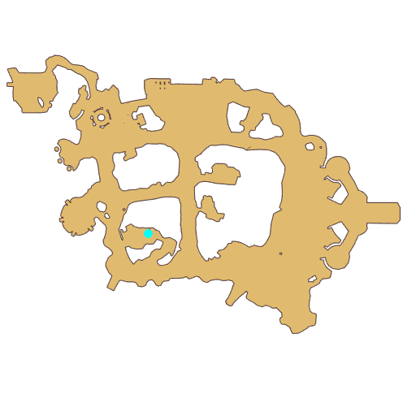

# Quest Trial 2

- Id: 10003
- Steps: 21
- Map: 2
- Next quest: [Trial 1](10030.md)
- Next quest: [Point Allocation Guide](400000001.md)
- Previous quest: [Trial 1](10002.md)

## Steps

### Step 5
- StepName:  Trial 2
- Map:  2
- Trace:  Tap the small map
- Type:  acc_main
- Content:  guide

### Step 6
- StepName:  Trial 2
- Map:  2
- Trace:  Tap the small map
- Type:  acc_main
- Content:  guide
- Visit NPC 1060, Banni

- 

### Step 7
- StepName:  Trial 2
- Map:  2
- Trace:  Talk to Examiner [c][ffff00][npcName][-][/c]
- Type:  acc_main
- Content:  visit
- Visit NPC 1060, Banni

- 

### Step 8
- StepName:  Trial 2
- Map:  2
- Trace:  
- Type:  acc_main
- Content:  dialog
- Dialog: (503605)Isn't this [c][ffff00][PlayerName][-][/c] and Cenia? I am Examiner Banni. This cute and docile Lunatic is called Lubies, my pet and also assistance in your examination.
- Dialog: (503820)I heard you cleared the first test perfectly. Well done.

### Step 11
- StepName:  Trial 2
- Map:  2
- Trace:  
- Type:  acc_main
- Content:  dialog
- Dialog: (503606)Of course, [c][ffff00][PlayerName][-][/c] and I are going become the greatest adventurers!
- Dialog: (503607)Quite ambitious, but I need to remind you: if you get too caught up in your victory, you will lose sight of the future.
- Dialog: (503608)Before studying and a new round of the test, let me see how capable you are!
- Dialog: (503609)Looks like Banni will test us first. Let's use the skills we learned previously to overcome the obstacles! - Options: No problem.

### Step 13
- StepName:  Trial 2
- Map:  2
- Trace:  Defeat [num] [c][ffff00][monsterName][-][/c]
- Type:  acc_main
- Content:  kill

### Step 15
- StepName:  Trial 2
- Map:  2
- Trace:  Satisfied Banni has something to say
- Type:  acc_main
- Content:  visit
- Visit NPC 1060, Banni

- 

### Step 16
- StepName:  Trial 2
- Map:  2
- Trace:  
- Type:  acc_main
- Content:  dialog
- Dialog: (503610)Perfect, it seems you have mastered the basics of combat.
- Dialog: (503611)But a thing to mention, sometimes the enemy is too powerful, and fighting them head-on is dangerous. You need to learn to distract them to save your strength. Only then can your adventures be long and lasting. Isn't that right? - Options: {A trick? ,0},{What do we do?,0}

### Step 17
- StepName:  Trial 2
- Map:  2
- Trace:  
- Type:  acc_main
- Content:  dialog
- Dialog: (503612)For example...

### Step 23
- StepName:  Trial 2
- Map:  2
- Trace:  
- Type:  acc_main
- Content:  dialog
- Dialog: (503613)Examiner Banni, what's wrong???? [c][ffff00][PlayerName][-][/c], did he suddenly die? I can't even hear his breathing! Is he really dead?!!!
- Dialog: (503821)Did he commit suicide? What shall we do? Should we find Examiner Vivinne? !!!!!

### Step 25
- StepName:  Trial 2
- Map:  2
- Trace:  
- Type:  acc_main
- Content:  dialog
- Dialog: (503614)Hahahahaha! Did you get fooled? - Options: Are you playing Dead?
- Dialog: (503615)That's right, if you find it hard to face your enemy in battle, [c][ffff00]Play Dead[-][/c] is a skill that will protect you from damage.
- Dialog: (503616)How awful, playing dead in the middle of a conversation!!! Give me back my tears!! Hmph!!!
- Dialog: (503617)Haha, sorry, I made you worry. I just want to prove that playing dead is very easy. You just have to hold your breath for a long time! - Options: Is that it...
- Dialog: (503618)Don't underestimate this skill. Let's put it in the most obvious place and see if you can use it to block Lubies' attack!

### Step 33
- StepName:  Trial 2
- Map:  2
- Trace:  Use Play Dead to dodge Lubies' attack
- Type:  acc_main
- Content:  guide

### Step 38
- StepName:  Trial 2
- Map:  2
- Trace:  
- Type:  acc_main
- Content:  dialog
- Dialog: (503619)Well done, Adventurer, it seems no matter what horrifying monsters show up, you can avoid them safely. Lubies, come back!

### Step 64
- StepName:  Trial 2
- Map:  2
- Trace:  Ask Banni what happened
- Type:  acc_main
- Content:  visit
- Visit NPC 1060, Banni

- 

### Step 65
- StepName:  Trial 2
- Map:  2
- Trace:  
- Type:  acc_main
- Content:  dialog
- Dialog: (503621)Lubies, my dear Lubies, how did she end up like this...
- Dialog: (503622)Examiner Banni, has something like this happened to Lubies before?
- Dialog: (503623)No... [c][ffff00][PlayerName][-][/c], Cenia, I think I need to leave to find Lubies first. I can't let her hurt innocent bystanders.
- Dialog: (503822)But don't worry, I will give you your successful transcripts before leaving.
- Dialog: (503624)Next, please find the position of the merchant team. That is the location of the final exam.

### Step 66
- StepName:  Trial 2
- Map:  2
- Trace:  Take the transcript from Banni
- Type:  acc_main
- Content:  use

### Step 73
- StepName:  Trial 2
- Map:  2
- Trace:  
- Type:  acc_main
- Content:  dialog
- Dialog: (503625)Examiner Banni, be careful on your search for Lubies!
- Dialog: (503626)Got it, you should also be careful. Strange phenomena have been seen in the South Gate, and I'm worried that a corrupt and twisted power has permeated this land. This power causes [c][ffff00]Time Rift[-][/c] to form, and Monsters become uncontrollable.  - Options: {Time Rift?,0},{Sounds dangerous,0}
- Dialog: (503627)That's right, the result of a kind of fearsome and void power, deep in the abyss of time and space. It has been long since it last appeared.
- Dialog: (503628)But don't you worry, there are many capable Guardians at the South Gate, and they will ensure your safety. You merely have to take your exam with ease. - Options: Then be careful

### Step 82
- StepName:  Trial 2
- Map:  2
- Trace:  Gift from the Headwear Collection Master
- Type:  acc_main
- Content:  visit
- Visit NPC 813245, Headwear-loving Tony

- 

### Step 83
- StepName:  Trial 2
- Map:  2
- Trace:  
- Type:  acc_main
- Content:  dialog
- Dialog: (503630)Hey there, friends, how did the second round of the test feel? - Options: Tell me the situation.
- Dialog: (503631)Eeek... Something like that, Lubies is extremely cute and docile. Why did it turn out like this?!!!
- Dialog: (503823)Tony, once we give [c][ffff00][PlayerName][-][/c] the gift, we should go help Banni!
- Dialog: (503632)No problem! To congratulate the two of you on passing the exam, Gina and I prepared 2 more Headwears for you.
- Dialog: (503633)Not just the Blueprint this time, it is [c][ffff00]Headwear[-][/c] that you can wear directly! Isn't it super sweet?!
- Dialog: (503634)Highly recommend the [c][ffff00]Maple Mirror[-][/c] that I picked out. This is a rare high-quality good. I used special materials to wrap the frame to prevent scratch, an essential Headwear for adventure!
- Dialog: (503635)Hey Hey hey! Stop looking at Tony! Look at me instead!
- Dialog: (503824)This is the [c][ffff00]Purple Disc Hairband[-][/c] that is popular across the Midgards Continent. No matter how many years pass by, it is by far the most beloved Headwear!
- Dialog: (503636)Then I, Cenia, will choose Purple Disc Hairband!

### Step 89
- StepName:  Trial 2
- Map:  2
- Trace:  
- Type:  acc_main
- Content:  dialog
- Dialog: (503637)Isn't it pretty? [c][ffff00][PlayerName][-][/c], which one do you like? - Options: {Maple Mirror,2},{Ribbon,3}

### Step 93
- StepName:  Trial 2
- Map:  2
- Trace:  
- Type:  acc_main
- Content:  dialog
- Dialog: (503638)Haha! I knew you would choose this!
- Dialog: (503640)Hehe, you can wear the Headwear to participate in the final exam! Good luck will be certain!! Let's meet again next time! - Options: Bye!

