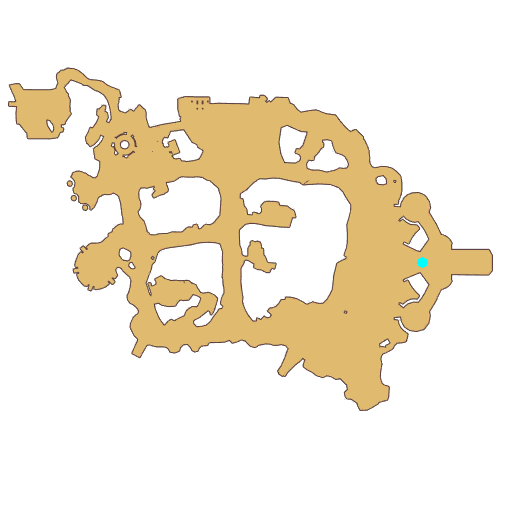

# Quest Final Test

- Id: 10007
- Steps: 5
- Map: 2
- Next quest: [Final Test](10008.md)
- Previous quest: [10006](10006.md)

## Steps

### Step 2
- StepName:  Final Test
- Map:  2
- Trace:  Talk to [c][ffff00][npcName][-][/c]
- Type:  acc_main
- Content:  visit
- Visit NPC 813253, Seyren

- 

### Step 3
- StepName:  Final Test
- Map:  2
- Trace:  
- Type:  acc_main
- Content:  dialog
- Dialog: (503700)[c][ffff00][PlayerName][-][/c], are you alright? - Options: {No Problem,2},{How could this be,3}

### Step 4
- StepName:  Final Test
- Map:  2
- Trace:  
- Type:  acc_main
- Content:  dialog
- Dialog: (503701)*Sigh* As an examiner of the Eden Team, I am sorry to have caused this to happen to you in your examinations.

### Step 6
- StepName:  Final Test
- Map:  2
- Trace:  
- Type:  acc_main
- Content:  dialog
- Dialog: (503703)The Midgards Continent has indeed been infiltrated by demonic forces recently. It appeared once before... as if in the dark abyss...
- Dialog: (503704)However, I didn't expect you to be able to resist this kind of power with ease. You've obviously just started learning how to fight... Could it... really be the Wind of Fate as the prophecy foretold... - Options: Wind of Fate?
- Dialog: (503705)A legendary wisp of hope from ancient times, which can resist the forces of evil. But no one has really seen it. Or perhaps, the Fate Gear has already started to turn...
- Dialog: (503706)But that can wait. [c][ffff00][PlayerName][-][/c], you still have more crucial things to do. - Options: Here is your exam score!
- Dialog: (503707)That's right. [c][ffff00][PlayerName][-][/c], thank you. I didn't think you'd solve the situation so successfully. - Options: Well, the exam score is...?
- Dialog: (503708)Of course, a perfect score, plus that previous battle. You will become the greatest graduate in Eden Team's history!
- Dialog: (503709)Great! !! [c][ffff00][PlayerName][-][/c] is so awesome! - Options: Understood!

### Step 7
- StepName:  Final Test
- Map:  2
- Trace:  Take the transcript from Seyren
- Type:  acc_main
- Content:  use

