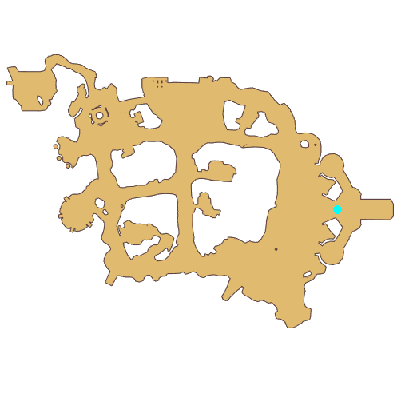

# Quest Final Test

- Id: 10008
- Steps: 17
- Map: 2
- Previous quest: [Final Test](10007.md)

## Steps

### Step 17
- StepName:  Final Test
- Map:  2
- Trace:  Seyren still has something to say
- Type:  acc_main
- Content:  visit
- Visit NPC 813253, Seyren

- 

### Step 18
- StepName:  Final Test
- Map:  2
- Trace:  
- Type:  acc_main
- Content:  dialog
- Dialog: (503727)Well done, [c][ffff00][PlayerName][-][/c]. Next, take the 3 transcripts and go find Vivinne in the Eden Team to take the final oath.
- Dialog: (503728)This is my pal Lili, and Moe Moe comes from the caravan. They both are excellent mounts, and you can choose one to ride your way back to Vivinne ASAP.
- Dialog: (503729)Seyren is embarrassed to tell you that this is the mount he borrowed specifically from the caravan so that he could show his gratitude to you. - Options: How thoughtful
- Dialog: (503730)Ah... No, didn't we agree on not telling them?
- Dialog: (503731)Pfft, an embarrassed Seyren is a sight to be held.

### Step 19
- StepName:  Final Test
- Map:  2
- Trace:  
- Type:  acc_main
- Content:  cutscene

### Step 21
- StepName:  Final Test
- Map:  2
- Trace:  
- Type:  acc_main
- Content:  dialog
- Dialog: (503734)[c][ffff00][PlayerName][-][/c], you pick first! - Options: {Lili,2},{Moe Moe,3}

### Step 38
- StepName:  Final Test
- Map:  2
- Trace:  
- Type:  acc_main
- Content:  dialog
- Dialog: (503726)By the way, we can only lend Moe Moe and Lili to you for [c][ffff00]one hour[-][/c], and they'll have to get back to their master when the time is up. - Options: Understood!
- Dialog: (503735)Please take care of this mount during this period!

### Step 39
- StepName:  Final Test
- Map:  2
- Trace:  Hand Vivinne the results
- Type:  acc_main
- Content:  visit
- Visit NPC 1054, Vivinne

- 

### Step 40
- StepName:  Final Test
- Map:  2
- Trace:  
- Type:  acc_main
- Content:  dialog
- Dialog: (503736)Thank you[c][ffff00][PlayerName][-][/c], I've been waiting here for a long time. How does it feel to own a mount? - Options: {Think it's cool,10},{It's okay,11}

### Step 41
- StepName:  Final Test
- Map:  2
- Trace:  
- Type:  acc_main
- Content:  dialog
- Dialog: (503766)Mounts are useful and also stylish!

### Step 48
- StepName:  Final Test
- Map:  2
- Trace:  
- Type:  acc_main
- Content:  dialog
- Dialog: (503770)Next, let me see the results of your exams!

### Step 49
- StepName:  Final Test
- Map:  2
- Trace:  Hand Vivinne the results
- Type:  acc_main
- Content:  use

### Step 52
- StepName:  Final Test
- Map:  2
- Trace:  
- Type:  acc_main
- Content:  dialog
- Dialog: (503737)Good job! Finally, I have a few questions, mandatory for all who wish to join the Eden Team and change their job to become a real adventurer. Are you ready? - Options: {Ready,5},{Wait,6}

### Step 53
- StepName:  Final Test
- Map:  2
- Trace:  
- Type:  acc_main
- Content:  question

### Step 56
- StepName:  Final Test
- Map:  2
- Trace:  
- Type:  acc_main
- Content:  question

### Step 59
- StepName:  Final Test
- Map:  2
- Trace:  
- Type:  acc_main
- Content:  question

### Step 66
- StepName:  Final Test
- Map:  2
- Trace:  Make your preparations and initiate the Final Test with Vivinne
- Type:  acc_main
- Content:  visit
- Visit NPC 1054, Vivinne

- 

### Step 67
- StepName:  Final Test
- Map:  2
- Trace:  
- Type:  acc_main
- Content:  dialog
- Dialog: (503737)Good job! Finally, I have a few questions, mandatory for all who wish to join the Eden Team and change their job to become a real adventurer. Are you ready? - Options: {Ready,5},{Wait,6}

### Step 68
- StepName:  Final Test
- Map:  2
- Trace:  
- Type:  acc_main
- Content:  dialog
- Dialog: (503738)I hereby officially announce that [c][ffff00][PlayerName][-][/c] and Cenia, congratulations on joining the Eden Team!

