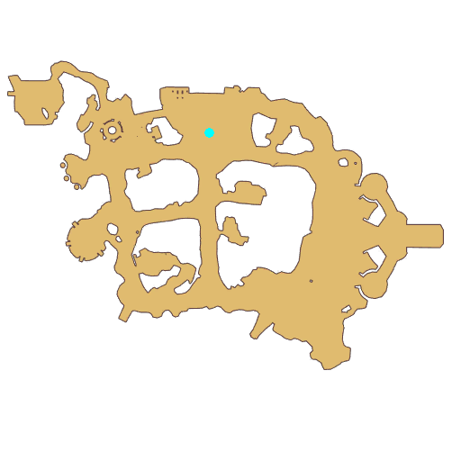

# Quest South Gate group photo

- Id: 10010
- Steps: 11
- Map: 2
- Next quest: [South Gate group photo NPC deleted](10120.md)
- Next quest: [Go to Prontera](40001.md)
- Previous quest: [South Gate group photo](10011.md)

## Steps

### Step 2
- StepName:  For the New Journey
- Map:  2
- Trace:  Talk to Vivinne after understanding the classes of the Six men team
- Type:  acc_main
- Content:  visit
- Visit NPC 813271, Vivinne

- 

### Step 3
- StepName:  For the New Journey
- Map:  2
- Trace:  
- Type:  acc_main
- Content:  dialog
- Dialog: (503815)Have you communicated properly with the team of 6 friends? Such an opportunity is pretty rare. After all, you can chat some more with your friends here... especially with Seyren and Magaleta. - Options: {Properly Communicated,2},{Wait More,3}

### Step 43
- StepName:  For the New Journey
- Map:  2
- Trace:  The friends who came to send you off have something to say
- Type:  acc_main
- Content:  visit
- Visit NPC 1059, Poi

- 

### Step 44
- StepName:  For the New Journey
- Map:  2
- Trace:  
- Type:  acc_main
- Content:  dialog
- Dialog: (503754)I heard there was a group photo, then I must transform into Poring and steal the spotlight!

### Step 45
- StepName:  For the New Journey
- Map:  2
- Trace:  
- Type:  acc_main
- Content:  dialog
- Dialog: (503750)Oh right! I've secretly got us some Bloodstain Branches. When you become mighty enough, we can try out the power of the Bloodstain Branch together.
- Dialog: (503751)Well done, [c][ffff00][PlayerName][-][/c], I always knew you will become an exceptional adventurer. - Options: Lubies is back?
- Dialog: (503752)That's right. After you defeated Phreeoni, my Lubies restored to normal.
- Dialog: (503755)Alright, alright, enough parting words, we're here for a commemorative group picture!
- Dialog: (503756)Oh yeah! [c][ffff00][PlayerName][-][/c], this is a prototype Mage Camera for you! There will be lots of wonderful counters on your journey. Record it whenever!

### Step 46
- StepName:  For the New Journey
- Map:  2
- Trace:  Take the Camera from Cenia
- Type:  acc_main
- Content:  use

### Step 49
- StepName:  For the New Journey
- Map:  2
- Trace:  
- Type:  acc_main
- Content:  dialog
- Dialog: (503757)My friends are a bit shy, so it's unnecessary to gather them to take a picture with me.

### Step 50
- StepName:  For the New Journey
- Map:  2
- Trace:  Group Photo Memoir
- Type:  acc_main
- Content:  use

### Step 51
- StepName:  For the New Journey
- Map:  2
- Trace:  Group Photo Memoir
- Type:  acc_main
- Content:  cutscene

### Step 52
- StepName:  For the New Journey
- Map:  2
- Trace:  Go to Prontera with Cenia
- Type:  acc_main
- Content:  visit
- Visit NPC 813252, Cenia

- 

### Step 53
- StepName:  For the New Journey
- Map:  2
- Trace:  
- Type:  acc_main
- Content:  dialog
- Dialog: (503758)By the way, [c][ffff00][PlayerName][-][/c], Vivinne just gave us the[c][ffff00]Pass[-][/c]. - Options: Pass?
- Dialog: (503759)That's right, give it to the soldier, and you can set out to Prontera as an adventurer formally!
- Dialog: (503760)I would like to accompany you, but I still have some stuff to do, hee hee. Let's meet up in Prontera!

