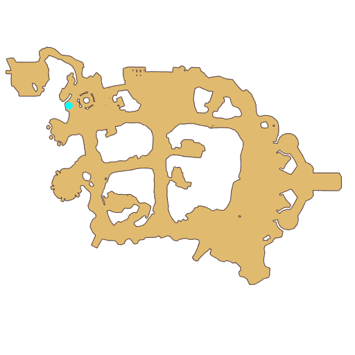

# Quest South Gate group photo

- Id: 10011
- Steps: 4
- Map: 2
- Next quest: [Trial 3](10061.md)
- Next quest: [Trial 3](10062.md)
- Next quest: [Trial 3](10063.md)
- Next quest: [Trial 3](10064.md)
- Next quest: [Trial 3](10065.md)
- Next quest: [Trial 3](10066.md)
- Next quest: [South Gate group photo](10010.md)
- Previous quest: [Final Test](10008.md)

## Steps

### Step 2
- StepName:  For the New Journey
- Map:  2
- Trace:  Cenia's New Plan
- Type:  acc_main
- Content:  visit
- Visit NPC 813252, Cenia

- 

### Step 3
- StepName:  For the New Journey
- Map:  2
- Trace:  
- Type:  acc_main
- Content:  dialog
- Dialog: (503744)[c][ffff00][PlayerName][-][/c], I'm so excited, we will soon be heading to Prontera as adventurers! - Options: {Prontera?,0},{Where are we going?,0}
- Dialog: (503745)Prontera! The Capital of our Kingdom of Rune! The high castle, the never-ending fountains, the travelers coming and going... the best city in Cenia's heart, bar none. - Options: Then let's go immediately
- Dialog: (503778)*Sigh* I'm missing my friends from the South Gate...
- Dialog: (503746)Since you guys have spent an unforgettable time in the South Gate, why not take a group photo together at the place where it all began?
- Dialog: (503747)Good idea!!! After all, the camera is another one of the greatest inventions of Midgards Continent!
- Dialog: (503748)Just click on it, and you can record what you like! You really have no excuse not to try it. Okay! The new plan of Cenia is to take pictures! - Options: No problem.
- Dialog: (503749)Then let's hit the road! There may be pleasant surprises waiting for you! - Options: Go to the starting place

### Step 14
- StepName:  For the New Journey
- Map:  2
- Trace:  Go to the starting place
- Type:  acc_main
- Content:  move

### Step 15
- StepName:  For the New Journey
- Map:  2
- Trace:  
- Type:  acc_main
- Content:  dialog
- Dialog: (503806)After knowing you passed the exam and are about to start a new journey, everyone has come to say a proper goodbye to you, [c][ffff00][PlayerName][-][/c].
- Dialog: (503807)Wow! This is the pleasant surprise Vivinne talked about, right?
- Dialog: (503808)Yes. Especially, Seyren and their friends are all standouts of [c][ffff00]different classes[-][/c] and can provide significant help to you guys for your journey that is about to start formally. - Options: Various classes?
- Dialog: (503809)Yes. In Prontera, you can choose to learn skills of various classes, such as the Assassin, the Mage, the Hunter, and so on. After training, you'll be an adventurer with a specialization.
- Dialog: (503810)But, [c][ffff00][PlayerName][-][/c], based on what I know you, I think you can even acquire skills of [c][ffff00]more than one[-][/c] classes to deal with various dilemmas encountered in your adventures.
- Dialog: (503825)After all, the continent is not peaceful now, and there seems to be some dark research going on in the Republic... - Options: What happened to the continent?
- Dialog: (503811)[c][ffff00]Seyren[-][/c] and [c][ffff00]Magaleta[-][/c] probably have more explicit points of view on this matter. So before taking the group picture, you can talk with everyone for some more.
- Dialog: (503812)And please come to tell me when you're done talking with them and wish to end the chatting part. - Options: No problem.

