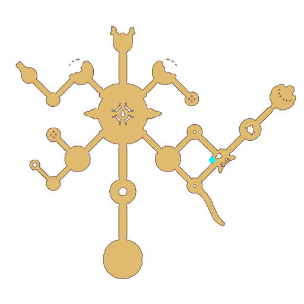

# Quest Eclage Atmosphere

- Id: 1001640015
- Steps: 1
- Map: 109

## Steps

### Step 0
- StepName:  Cha-cha music
- Map:  109
- Trace:  
- Type:  talk
- Content:  visit
- Visit NPC 805318, Julac Hailar

- 
- Dialog: (401945)Hi! Hello, very Cha-cha friend! - Options: Cha-cha?
- Dialog: (401946)Cha-cha! This is my latest invented word. Absolute unique in Eclage!
- Dialog: (401947)For example. Today I had a Muzika Cupcake, which made me feel like I can fly to the top of Yggdrasil. And that cup cake was "very Cha-cha".
- Dialog: (401948)Another example... You are very cute, I like you. So, you are also very Cha-cha! - Options: Got it.
- Dialog: (401949)In short, Cha-cha is a very good word. But now I am very worried. How can I make my music Cha-cha?
- Dialog: (401950)(Talking) The selection of instrument players is coming soon. I also want to show something different from others. - Options: Find Cha-cha inspiration
- Dialog: (401951)Well, Cha-cha needs inspiration. Inspiration... Inspiration... Oh, I'm so stupid!
- Dialog: (401952)-- Isn’t the most Cha-cha guy in Eclage right in front of me?

