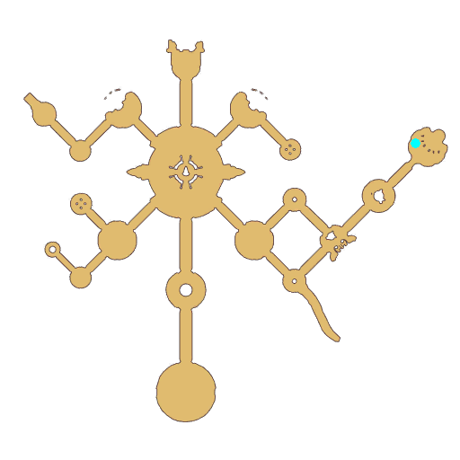

# Quest Eclage Atmosphere

- Id: 1001640025
- Steps: 1
- Map: 109

## Steps

### Step 0
- StepName:  Moan and Groan
- Map:  109
- Trace:  
- Type:  talk
- Content:  visit
- Visit NPC 805332, Jojo Meral

- 
- Dialog: (402135)Hey... Another world Adventurer. Take my advice and go back to where you came from. - Options: ？？
- Dialog: (402144)(Sigh) So you, guest from afar... should hurry and leave. Go home.
- Dialog: (402136)I'll tell you a secret—Eclage is done for. - Options: ？？？
- Dialog: (402137)...The Star Bridge! It was destroyed!
- Dialog: (402138)That's the bridge to Asgard! Our connection with the gods has been cut off!
- Dialog: (402139)The Pixies have guarded the Star Bridge for generations... This means that we've failed to uphold our pact with the gods! The gods will surely exact divine punishment!
- Dialog: (402140)Even though we have the Goddess, she's so gentle, and she's also injured...
- Dialog: (402141)If those gods of Asgard lose their temper, I'm afraid that even the Goddess will be unable to stop them!
- Dialog: (402142)We might look like lucky survivors now. But the day Eclage is truly destroyed, none of us will be able to escape! - Options: Then why don't you run?
- Dialog: (402143)...I will not run. I am one of the Aurora Wings. I must protect the people here.

