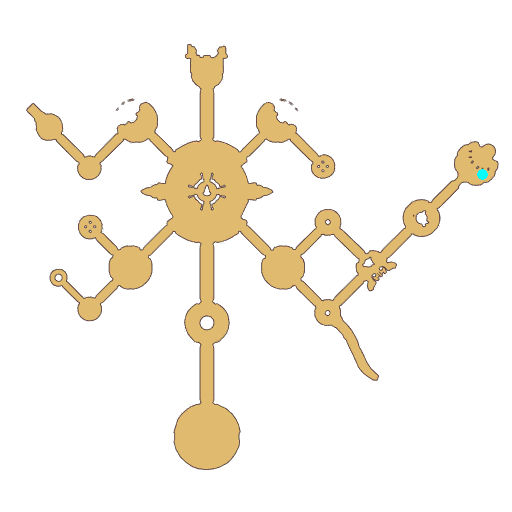

# Quest Eclage Atmosphere

- Id: 1001640026
- Steps: 1
- Map: 109

## Steps

### Step 0
- StepName:  Caring regards
- Map:  109
- Trace:  
- Type:  talk
- Content:  visit
- Visit NPC 805333, Moses Meral

- 
- Dialog: (402147)It's the adventurer from another world! Have you managed to adjust to life here? - Options: {Yes,0},{Still a bit unfamiliar,0}
- Dialog: (402148)Hm, well, everything must come slowly!
- Dialog: (402149)Having said that, your arrival is a rare positive thing for Eclage. - Options: How do you figure?
- Dialog: (402150)Everyone has been very dispirited ever since the Star Bridge
 was destroyed.
- Dialog: (402151)Not to mention that we were betrayed by one of our own... It's been a tragic time. - Options: Betrayed?
- Dialog: (402152)Yeah. The one who destroyed the Star Bridge was a formerly trusted companion of ours.
- Dialog: (402153)...But that's all in the past. Now, a new life has begun!
- Dialog: (402154)I believe that your visit has proven this.
- Dialog: (402155)I hope you have a pleasant time in Eclage~

