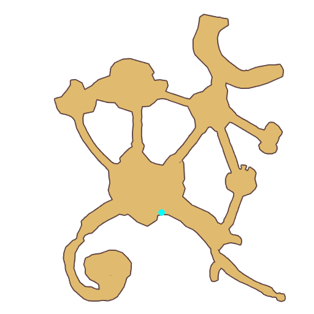

# Quest Eclage Atmosphere

- Id: 1001640042
- Steps: 1
- Map: 110

## Steps

### Step 0
- StepName:  Soothsayer
- Map:  110
- Trace:  
- Type:  talk
- Content:  visit
- Visit NPC 805344, Nanabi Upo

- 
- Dialog: (402336)Calm down. Don't argue now. - Options: I didn't say anything?
- Dialog: (402337)(Glancing at you) I wasn't talking to you. I was talking to these flowers. - Options: Flowers?
- Dialog: (402338)Huh, strange. I can understand the language of other creatures.
- Dialog: (402339)But these flowers in the Time Garden... No matter how much I listen, I still can't understand what they're saying. - Options: {You can,0},{Talk with plants,0}
- Dialog: (402340)(Glancing at you again) Not just plants. All living creatures. We Little Fairies are Soothsayers. We can communicate with them through our spirit language.
- Dialog: (402341)It's a talent that our kind possess. Don't be envious, incompetent outsider.

