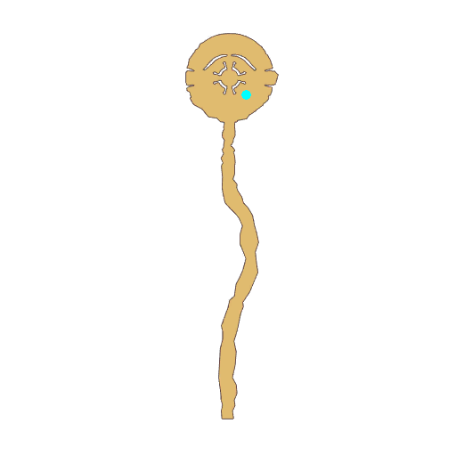

# Quest Eclage Atmosphere

- Id: 1001640076
- Steps: 1
- Map: 121

## Steps

### Step 0
- StepName:  About the sea of clouds
- Map:  121
- Trace:  
- Type:  talk
- Content:  visit
- Visit NPC 805352, Gilbertus Emiliar

- 
- Dialog: (402394)Hello, Another world Adventurer. This is the Sea of Azure Clouds. It sits on the border of the Glorious Domain.
- Dialog: (402395)Our Grand Priest Zanubia has set up a magic array of restoration here to repair the collapsed Star Bridge.
- Dialog: (402396)As representatives of the High Priest, Rheinhardt and I are here for the time being.
- Dialog: (402397)If possible, I ask that you please don't wander around... If more fragments of the Star Bridge were to start falling, this place would become extremely dangerous.

