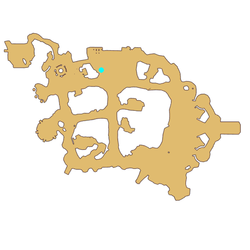

# Quest Trial 3

- Id: 10061
- Steps: 2
- Map: 2
- Previous quest: [South Gate group photo](10011.md)

## Steps

### Step 2
- StepName:  Eremes Gale
- Map:  2
- Trace:  
- Type:  acc_branch
- Content:  visit
- Visit NPC 813254, Eremes

- 

### Step 3
- StepName:  Eremes Gale
- Map:  2
- Trace:  
- Type:  acc_branch
- Content:  dialog
- Dialog: (503710)The final blade slash from [c][ffff00][PlayerName][-][/c] in the previous battle, did it leave a deep impression on you? Ha! We assassins have always been a perfect combination of capability and charm, after all! - Options: Are you an assassin?
- Dialog: (503711)Yes, I'm assassin Eremes! Focused [c][ffff00]surprise strike[-][/c] will [c][ffff00]kill the target with one hit[-][/c].
- Dialog: (503827)The double edge of the phantom enables you to boost your speed and strength. You're welcome to join us if you're interested! - Options: Got it!

