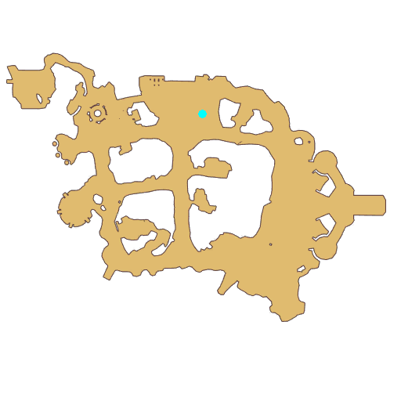

# Quest Trial 3

- Id: 10066
- Steps: 2
- Map: 2
- Previous quest: [South Gate group photo](10011.md)

## Steps

### Step 2
- StepName:  Seyren Windsor
- Map:  2
- Trace:  
- Type:  acc_branch
- Content:  visit
- Visit NPC 813253, Seyren

- 

### Step 3
- StepName:  Seyren Windsor
- Map:  2
- Trace:  
- Type:  acc_branch
- Content:  dialog
- Dialog: (503721)As you can see, I am a swordsman who has received a qualitative increase in power and strength after resonating with my own sword. - Options: {Advantages of a swordsman?,2},{About this world!,3}

