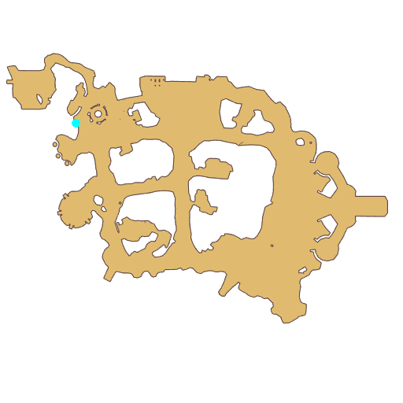

# Quest Novice

- Id: 10100
- Steps: 6
- Map: 2
- Next quest: [Trial 1](10002.md)
- Previous quest: [Novice](10001.md)

## Steps

### Step 2
- StepName:  Register
- Map:  2
- Trace:  Ask [c][ffff00][npcName][-][/c] about Eden Team exam
- Type:  acc_main
- Content:  visit
- Visit NPC 1054, Vivinne

- 

### Step 3
- StepName:  Register
- Map:  2
- Trace:  
- Type:  acc_main
- Content:  dialog
- Dialog: (503547)Are you [c][ffff00][PlayerName][-][/c]? You look quite eager, but let me make sure!
- Dialog: (503548)Hmmm... No substitution, nor any tools for cheating. Alright, done checking! Before the exam, I have a serious question, and I hope you can answer me seriously! - Options: Answer carefully

### Step 4
- StepName:  Register
- Map:  2
- Trace:  
- Type:  acc_main
- Content:  question

### Step 5
- StepName:  Register
- Map:  2
- Trace:  
- Type:  acc_main
- Content:  dialog
- Dialog: (503550)Perfect! Committed and enthusiastic, essential qualities for adventuring, deserve praise. 
- Dialog: (503551)Next will be a brief introduction to the exam to join: There is a total of [c][ffff00]3 tests[-][/c]. Every time you finish a test, the examiner there will tell you the examiner and the location of the next test. Complete all of them and see me for the final join process.
- Dialog: (503552)By the way, to support you in the tests, we've prepared special newbie gears for you.  Not bad, eh? Would you like to collect them now? - Options: Claim NOW

### Step 9
- StepName:  Register
- Map:  2
- Trace:  
- Type:  acc_main
- Content:  dialog
- Dialog: (503553)I have cast a magic spell called "Wind Walk" on you to help you get to your destination for the exam more quickly.
- Dialog: (503554)The magic effect will last for a while. I hope you can make good use of it to pass your exams and not let me down. - Options: The first test is?
- Dialog: (503555)[c][ffff00]Test 1[-][/c]
Content is below: Poi have a request for the adventurers, go check it out...
- Dialog: (503556)Poi often rests on the west of the South Gate. Go left and down from there, and you should see it. You should hurry over and check it out, don't cause any trouble.
- Dialog: (503557)Eh... This is the Trial?
- Dialog: (503558)So? The daily tasks of an adventurer include exploring the world while also dealing with all sorts of sudden events and completing a variety of quests. There is a lot to do... Much more complex than you imagined, stay sharp.
- Dialog: (503559)By the way, do you know how to quickly find Poi? - Options: {I know,0},{I don't,6}

### Step 10
- StepName:  Register
- Map:  2
- Trace:  Find Poi
- Type:  acc_main
- Content:  dialog
- Dialog: (503817)Then get going! Poi is waiting for you guys!

