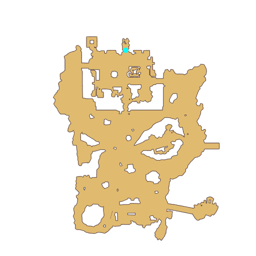

# Quest Ruined Morroc City

- Id: 1102230001
- Steps: 1
- Map: 16

## Steps

### Step 0
- StepName:  Ruined Morroc City
- Map:  16
- Trace:  
- Type:  branch
- Content:  visit
- Visit NPC 1553, Barlaud

- 
- Dialog: (145820)Ugh...We did our best, but we still...couldn't protect Morroc. - Options: I understand
- Dialog: (145821)The Monster King’s invasion of Morroc has caused catastrophic damage across the continent.
- Dialog: (145822)And the most serious is this seal on his body in Morroc. - Options: Yeah.
- Dialog: (145823)The buildings and land of the city will not return to its original form...
- Dialog: (145824)Adventurer, I hope you can help me out. [c][ff0000]Use a camera to photograph the sight of this destruction at the hands of the Monster King.[-][/c]
- Dialog: (145825)[c][ff0000]Please explore all parts of the city! It’s possible that the best shots can be found in different corners of the city, but I’m sure you will find them.[-][/c]
- Dialog: (145826)Only by passing on these sights to future generations will they understand never to stop defending against the otherworld. - Options: I understand.

