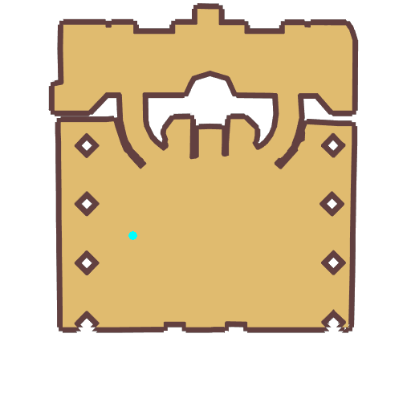

# Quest Be an Archer

- Id: 11040011
- Steps: 10
- Map: 1001
- Previous quest: [22580004](22580004.md)

## Steps

### Step 0
- StepName:  Be an Archer
- Map:  1001
- Trace:  Find [c][ffff00][npcName][-][/c] to change your job
- Type:  branch
- Content:  visit
- Visit NPC 1104, Kebak

- 
- Dialog: (650)(This dapper, handsome man waves at you from afar, as if he has known you for a long time...)
- Dialog: (651)A fancy job like a [c][ffff00]Archer[-][/c] really suits you perfectly. Well, let me test you first.
- Dialog: (682) - Options: {Confirm to transfer to a Archer,100}

### Step 7
- StepName:  Be an Archer
- Map:  1001
- Trace:  Take the tests for Archers
- Type:  branch
- Content:  question

### Step 10
- StepName:  Be an Archer
- Map:  1001
- Trace:  Take the tests for Archers
- Type:  branch
- Content:  question

### Step 13
- StepName:  Be an Archer
- Map:  1001
- Trace:  Take the tests for Archers
- Type:  branch
- Content:  question

### Step 17
- StepName:  Be an Archer
- Map:  1001
- Trace:  Take the tests for Archers
- Type:  branch
- Content:  visit
- Visit NPC 1104, Kebak

- 
- Dialog: (654)Oh dear. Was I speaking too fast? Think carefully before you answer.  - Options: Wrong Answer

### Step 37
- StepName:  Be an Archer
- Map:  1001
- Trace:  Take the tests for Archers
- Type:  branch
- Content:  visit
- Visit NPC 1104, Kebak

- 
- Dialog: (655)You've done it! I knew these questions would be far too easy for you. But we do still have to follow procedure, You know. Next is the [c][ffff00]Combat Trial[-][/c]. Speak to me when you're ready!

### Step 38
- StepName:  Be an Archer
- Map:  1001
- Trace:  Take the tests for Archers
- Type:  branch
- Content:  visit
- Visit NPC 1104, Kebak

- 
- Dialog: (656)Hack, cough, wheeze... Next is the [c][ffff00]Combat Trial[-][/c], where you will be pitted against real weapons. I'm beginning to feel just as nervous as you are, I imagine!
- Dialog: (657)Your Trial instructions are: Flee[c][ffff00]Traps[-][/c] and collect [c][ffff00]5 Thick Branches[-][/c]! [c][ffff00]Transformed Willows [-][/c] drop [c][ffff00]Thick Branches[-][/c] when defeated. But do be careful of the [c][ffff00]Traps[-][/c], and take care not to get hurt!
- Dialog: (658)Egads! I'm worried that you'll get hurt, [c][ffff00][PlayerName][-][/c]. Perhaps I should accompany you? - Options: {Interrupt him and begin the Trial,6}{My head hurts...,5}

### Step 39
- StepName:  Be an Archer
- Map:  1001
- Trace:  Take the tests for Archers
- Type:  branch
- Content:  raid

### Step 40
- StepName:  Be an Archer
- Map:  1001
- Trace:  Take the tests for Archers
- Type:  branch
- Content:  visit
- Visit NPC 1104, Kebak

- 
- Dialog: (659)Huzzah! You made that look easy! Are you hurt?  - Options: {Take me to the job ceremony,8}{...Leave,7}

### Step 41
- StepName:  Be an Archer
- Map:  1001
- Trace:  Go to the Adventure Hall
- Type:  branch
- Content:  raid

