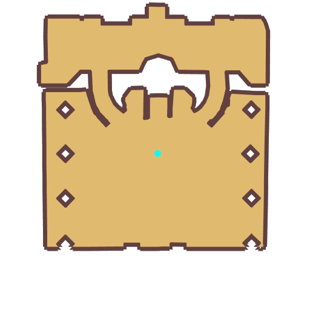

# Quest Select Job

- Id: 11500006
- Steps: 3
- Map: 1001
- Next quest: [Allocate Skill Points](400040001.md)

## Steps

### Step 0
- StepName:  Visit Cenia
- Map:  1001
- Trace:  Report to [c][ffff00][npcName][-][/c]
- Type:  branch
- Content:  visit
- Visit NPC 1024, Higgy Eez

- 
- Dialog: (2251)You've successfully left your Novice phase. Your friend Cenia seems to have changed jobs as well. Maybe you should go speak to her?  - Options: {Leave,0}

### Step 3
- StepName:  Visit Cenia
- Map:  1001
- Trace:  Talk to [c][ffff00][npcName][-][/c]
- Type:  branch
- Content:  visit
- Visit NPC 1051, Cenia

- 
- Dialog: (2252)Look, [c][ffff00][PlayerName][-][/c]! I'm a Swordsman. Don't I look stunning? - Options: {Absolutely,11}

### Step 14
- StepName:  Visit Cenia
- Map:  1001
- Trace:  Talk to [c][ffff00][npcName][-][/c]
- Type:  branch
- Content:  visit
- Visit NPC 1051, Cenia

- 
- Dialog: (2256)[c][ffff00][PlayerName][-][/c], you've become an [c][ffff00]Archer[-][/c]? You're in charge of DPS! I'm looking forward to having you shoot an apple off my head!  - Options: {Great,0}
- Dialog: (311)We've prepared a present to celebrate you successfully choosing a job. It should help you. - Options: Accept gift

