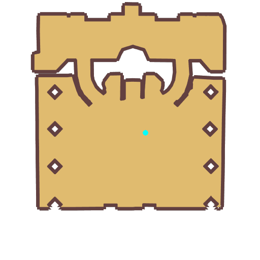

# Quest Nes from Baphomet

- Id: 120002
- Steps: 6
- Map: 1, 1001
- Next quest: [Mjolnir Mountains](13000001.md)
- Previous quest: [Nes from Baphomet](120001.md)

## Steps

### Step 0
- StepName:  Return to Prontera
- Map:  1
- Trace:  Return to Prontera
- Type:  acc_main
- Content:  dialog
- Dialog: (3554)Isn't that [c][ffff00]Eric[-][/c]? Go say hello.

### Step 1
- StepName:  Return to Prontera
- Map:  1
- Trace:  Greet Eric
- Type:  acc_main
- Content:  visit
- Visit NPC 1118, Eric

- 
- Dialog: (3555)Hi, [c][ffff00]Eric[-][/c], how are you?
- Dialog: (3556)[c][ffff00][PlayerName][-][/c], welcome back. The city is much better now, but the sewers still needs cleaning!
- Dialog: (3557)Cenia has improved a lot lately. He's in the Transfer Hall.

### Step 3
- StepName:  Return to Prontera
- Map:  1001
- Trace:  Enter Job Hall
- Type:  acc_main
- Content:  move

### Step 5
- StepName:  Return to Prontera
- Map:  1001
- Trace:  Give Cenia a Surprise
- Type:  acc_main
- Content:  visit
- Visit NPC 1051, Cenia

- 
- Dialog: (3558)Cenia!
- Dialog: (3559)[c][ffff00][PlayerName][-][/c], wandering around again? I'm quite strong now, so I can apply for the Knight test!
- Dialog: (3560)Knight? I hope I can also start my job upgrading test ASAP...
- Dialog: (3561)Go! If you need help, just come to me, the Queen of Adventures!

### Step 7
- StepName:  Return to Prontera
- Map:  1001
- Trace:  Report Baphomet's news to [c][ffff00][npcName][-][/c]
- Type:  acc_main
- Content:  visit
- Visit NPC 1024, Higgy Eez

- 
- Dialog: (3562)Long time no see. I've heard many explorers complimenting you, well done!
- Dialog: (3563)Without the help of [c][ffff00]Lord Cotholar[-][/c], I can never do it.
- Dialog: (3564) Though I don't want to believe it, I'm afraid it's true. [c][ffff00]Baphomet[-][/c] really was revived?
- Dialog: (3565)Yes, it looks the same as the descriptions, but it's not really powerful.
- Dialog: (3566)Don't be arrogant. The one you met must be [c][ffff00]Baphomet's phantom[-][/c]. It's not powerful!
- Dialog: (3567)…
- Dialog: (3568)You have a letter from Geffen, I think you need to have a check.

### Step 9
- StepName:  Return to Prontera
- Map:  1001
- Trace:  
- Type:  acc_main
- Content:  cutscene

