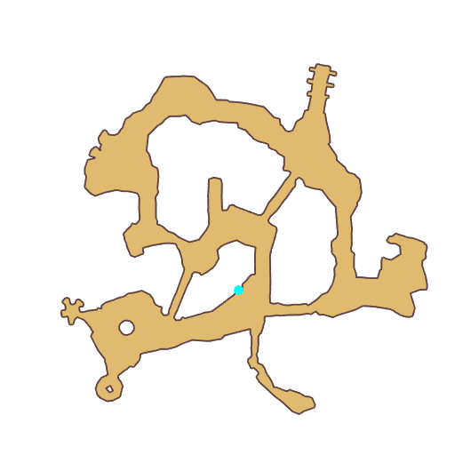

# Quest Underwater Cave Collectible

- Id: 204370001
- Steps: 9
- Map: 11

## Steps

### Step 2
- StepName:  Dreamy Seaweed
- Map:  11
- Trace:  
- Type:  branch
- Content:  visit
- Visit NPC 8839, General Crab

- 
- Dialog: (301999)Hey, kid! I'm talking to you! - Options: {You mean me?,3},{pretend you didn't hear,2}

### Step 3
- StepName:  Dreamy Seaweed
- Map:  11
- Trace:  
- Type:  branch
- Content:  dialog
- Dialog: (302000)Yeah, you!
- Dialog: (302001)Who let you wander about here? - Options: Ah?
- Dialog: (302002)This is General Crab of the evil sea folk's domain!
- Dialog: (302003)You didn't notice? - Options: Evil sea folk...
- Dialog: (302004)Right now the evil sea folk have the Four-Sea Treasure, the strongest power of the ocean!
- Dialog: (302005)Stinkin' human, if you're smart about it you'll kneel.
- Dialog: (302006)Perhaps I could accept you as a little brother. - Options: No way!

### Step 10
- StepName:  Dreamy Seaweed
- Map:  11
- Trace:  
- Type:  branch
- Content:  dialog
- Dialog: (302007)Haha, your attack is pathetic and can't hurt me at all. - Options: What?!
- Dialog: (302008)My pincers will shield the Four-Sea Treasure--Seaweed Dream!
- Dialog: (302009)Anything covered by Seaweed Dreams is protected from any attacks.
- Dialog: (302010)I am invincible, haha! - Options: Oh no!
- Dialog: (302011)Stinkin' human, come again, if you dare!
- Dialog: (302012)I didn't tell you, my weakness is sea salt! - Options: Oh... I see
- Dialog: (302013)There's some sea salt nearby, go pick some up.

### Step 13
- StepName:  Dreamy Seaweed
- Map:  11
- Trace:  
- Type:  branch
- Content:  collect

### Step 15
- StepName:  Dreamy Seaweed
- Map:  11
- Trace:  
- Type:  branch
- Content:  use

### Step 20
- StepName:  Dreamy Seaweed
- Map:  11
- Trace:  
- Type:  branch
- Content:  dialog
- Dialog: (302017)Effected by the sea salt, the Seaweed Dream's defense is weakened.
- Dialog: (302018)Oh no! How can this be? - Options: Look!

### Step 21
- StepName:  Dreamy Seaweed
- Map:  11
- Trace:  
- Type:  branch
- Content:  raid

### Step 29
- StepName:  Dreamy Seaweed
- Map:  11
- Trace:  
- Type:  branch
- Content:  dialog
- Dialog: (302019)General Crab, scared out of his mind, abandons the Seaweed Dream and disappears in an instant.

### Step 30
- StepName:  Dreamy Seaweed
- Map:  11
- Trace:  
- Type:  branch
- Content:  use

