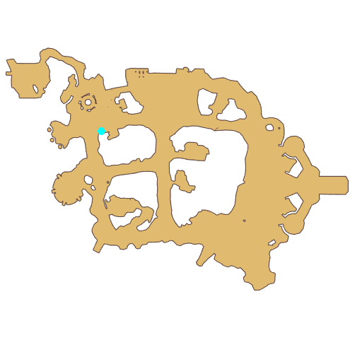

# Quest Cat and Yarn Ball

- Id: 204440001
- Steps: 8
- Map: 2
- Next quest: [Cat and Yarn Ball](204440002.md)

## Steps

### Step 6
- StepName:  Cat and Yarn Ball
- Map:  2
- Trace:  
- Type:  branch
- Content:  visit
- Visit NPC 8852, Yarn Ball

- 

### Step 7
- StepName:  Cat and Yarn Ball
- Map:  2
- Trace:  
- Type:  branch
- Content:  check_group

### Step 10
- StepName:  Cat and Yarn Ball
- Map:  2
- Trace:  
- Type:  branch
- Content:  dialog
- Dialog: (302197)There's an adorable ball of yarn on the ground, do you want to take a look? - Options: {Check it out,3},{Ignore it,4}

### Step 18
- StepName:  Cat and Yarn Ball
- Map:  2
- Trace:  
- Type:  branch
- Content:  dialog
- Dialog: (302198)Hey, kid, over there! What are you doing?

### Step 19
- StepName:  Cat and Yarn Ball
- Map:  2
- Trace:  Talk to Aunt Merry, the owner of Yarn Ball
- Type:  branch
- Content:  visit
- Visit NPC 8856, Aunt Merry

- 
- Dialog: (302199)Kid, be careful not to mess up the yarn ball I just wound up! - Options: I'm sorry.

### Step 21
- StepName:  Cat and Yarn Ball
- Map:  2
- Trace:  
- Type:  branch
- Content:  dialog
- Dialog: (302200)I used Lunatic's fur to painstakingly weave this ball of yarn! - Options: For what?
- Dialog: (302201)Don't tell me you didn't see the notice on the Kitty House board? - Options: Kitty House?
- Dialog: (302202)This place used to be bustling and now Kitty House has become desolate. These little guys can't live without their yarn balls! I must do what I can to bring these adorable kitties back to the South Gate! - Options: How?
- Dialog: (302203)Don't underestimate me, finding yarn is my speciality! These kitties love their yarn balls, I can weave 100 a day! - Options: What talent.
- Dialog: (302204)Even though I'm an expert at weaving yarn, but without enough materials there's nothing I can do! To complete the yarn balls I need 10 furs from Lunatics, can you help me out? - Options: No problem.
- Dialog: (302205)You're a kid full of vigor, please help me!

### Step 22
- StepName:  Cat and Yarn Ball
- Map:  2
- Trace:  Collect [num] Fur from Lunatic
- Type:  branch
- Content:  gather

### Step 23
- StepName:  Cat and Yarn Ball
- Map:  2
- Trace:  Give Aunt Merry Fur as material for Yarn Ball
- Type:  branch
- Content:  visit
- Visit NPC 8856, Aunt Merry

- 
- Dialog: (302206)Great, you really are a good kid! - Options: Thank you
- Dialog: (302207)OK, if you take this ball of yarn to the Kitty House, then those playful scamps will surely return!

