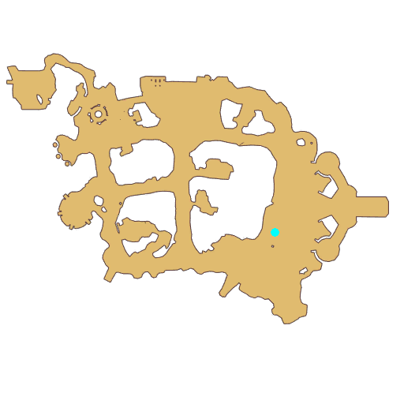

# Quest Cat and Clockwork Mouse

- Id: 204460001
- Steps: 16
- Map: 2
- Next quest: [Cat and Clockwork Mouse](204460002.md)

## Steps

### Step 4
- StepName:  Cat and Clockwork Mouse
- Map:  2
- Trace:  
- Type:  branch
- Content:  visit
- Visit NPC 8854, Spring Squeak

- 

### Step 5
- StepName:  Cat and Clockwork Mouse
- Map:  2
- Trace:  
- Type:  branch
- Content:  check_group

### Step 6
- StepName:  Cat and Clockwork Mouse
- Map:  2
- Trace:  
- Type:  branch
- Content:  waitui

### Step 8
- StepName:  Cat and Clockwork Mouse
- Map:  2
- Trace:  
- Type:  branch
- Content:  dialog
- Dialog: (302227)There's a small blue toy mouse on the ground, do you want to check it out? - Options: {Check it out,3},{Ignore it,4}

### Step 17
- StepName:  Cat and Clockwork Mouse
- Map:  2
- Trace:  
- Type:  branch
- Content:  dialog
- Dialog: (302228)Thief, drop my toy mouse!

### Step 18
- StepName:  Cat and Clockwork Mouse
- Map:  2
- Trace:  Talk to angry boy Tommy
- Type:  branch
- Content:  visit
- Visit NPC 8859, Tommy

- 
- Dialog: (302229)Hurry up and drop it! - Options: Where did you find it?
- Dialog: (302230)Here, from inside the treehouse of the Kitty House. Hmm, those lazybones sleep all day and don't play with me! I should play with this mouse! - Options: Leave
- Dialog: (302231)You can't just take it... - Options: But what?
- Dialog: (302232)You need to replace my toy mouse! Play with me until I get another! - Options: Alright
- Dialog: (302233)Excellent, let's play hide and seek! - Options: No problem.

### Step 22
- StepName:  Cat and Clockwork Mouse
- Map:  2
- Trace:  Find hidden Tommy
- Type:  branch
- Content:  use

### Step 23
- StepName:  Cat and Clockwork Mouse
- Map:  2
- Trace:  
- Type:  branch
- Content:  dialog
- Dialog: (302234)It doesn't look like Tommy is hiding here.

### Step 24
- StepName:  Cat and Clockwork Mouse
- Map:  2
- Trace:  Continue to find hidden Tommy
- Type:  branch
- Content:  use

### Step 25
- StepName:  Cat and Clockwork Mouse
- Map:  2
- Trace:  
- Type:  branch
- Content:  dialog
- Dialog: (302235)It doesn't look like Tommy is hiding here either.

### Step 26
- StepName:  Cat and Clockwork Mouse
- Map:  2
- Trace:  Find hidden Tommy
- Type:  branch
- Content:  use

### Step 27
- StepName:  Cat and Clockwork Mouse
- Map:  2
- Trace:  
- Type:  branch
- Content:  dialog
- Dialog: (302236)Tommy isn't here either, where did that child get to?

### Step 30
- StepName:  Cat and Clockwork Mouse
- Map:  2
- Trace:  
- Type:  branch
- Content:  dialog
- Dialog: (302237)Help! Help me!

### Step 33
- StepName:  Cat and Clockwork Mouse
- Map:  2
- Trace:  
- Type:  branch
- Content:  dialog
- Dialog: (302238)I wasn't careful and got tangled in the thorns! Help me!

### Step 34
- StepName:  Cat and Clockwork Mouse
- Map:  2
- Trace:  Remove [num] Thorns and save Tommy
- Type:  branch
- Content:  kill

### Step 36
- StepName:  Cat and Clockwork Mouse
- Map:  2
- Trace:  Give Tommy who likes running around a good lecture
- Type:  branch
- Content:  visit
- Visit NPC 8859, Tommy

- 
- Dialog: (302239)You scared me so badly just now, I really thought you had abandoned me! - Options: Still gonna keep running around?
- Dialog: (302240)No way, when you fought the thorns, I'll truly believe you are the greatest hero in the world! - Options: It was nothing...
- Dialog: (302241)It's been a long time since anyone cared about me. Meeting someone as kind as you makes me so happy! Here, you can take this toy mouse!

