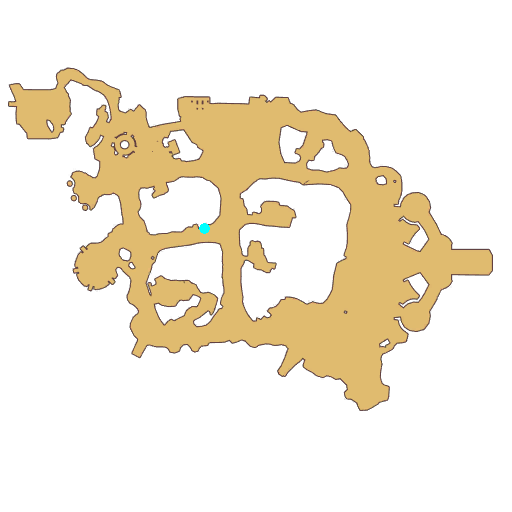

# Quest Kitty's Request

- Id: 204480001
- Steps: 2
- Map: 2

## Steps

### Step 0
- StepName:  Kitty's Request
- Map:  2
- Trace:  
- Type:  talk
- Content:  visit
- Visit NPC 8851, Board

- 
- Dialog: (302188)There seems to be an odd notice posted on this tree house's announcement board. Do you want to take a closer look? - Options: {Go closer,2},{Leave,3}

### Step 2
- StepName:  Kitty's Request
- Map:  2
- Trace:  
- Type:  talk
- Content:  dialog
- Dialog: (302189)The announcement has four handwritten requests, with a meatball seal on the lower right corner. - Options: First Request
- Dialog: (302190)The first request says: " Help! Meow!" Kitty House doesn't feel like a home without balls of yarn. Can a kind person bring us a soft ball of yarn? Meow-meow!" - Options: ……
- Dialog: (302191)"If there were balls of yarn we'd come back in an instant! Meow!" - Options: Second Request
- Dialog: (302192)The second request says: "My goodness, there is no more dried fish left in Kitty House! We had no choice but to leave in search of dried fish, meow." - Options: ……
- Dialog: (302193)"If there was dried fish we'd come back and happily devour it all, meow!" - Options: Third Request
- Dialog: (302194)The third request says: "How can this be good? Meow! Our beloved clockwork mice have disappeared without a trace, did they leave because we played with them too hard? We don't want to stay in Kitty House without clockwork mice, meow!" - Options: ……
- Dialog: (302195)"If there were clockwork mice again in Kitty House we'd return to play, meow!" - Options: Fourth Request
- Dialog: (302196)"Everyone left Kitty House for different reasons, I didn't want to be the only kitty staying here, so it would be great if everyone came back."

