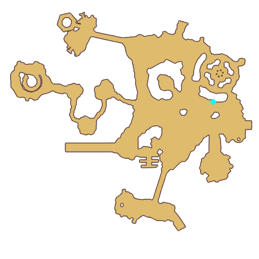

# Quest Gourmet Notes

- Id: 204870006
- Steps: 7
- Map: 5

## Steps

### Step 0
- StepName:  Wonderland Cake
- Map:  5
- Trace:  Take the ingredients to Barbara
- Type:  branch
- Content:  visit
- Visit NPC 7541, Barbara

- 
- Dialog: (304978)Unexpectedly, this came so fast! Thanks to you, banana butter, rainbow tapioca pudding, pinecone pudding, cloud crisp and dew jam are ready! - Options: Piece of cake
- Dialog: (304979)Leave the rest to me. I'll make a perfect fairyland cake! - Options: Please look forward to that!
- Dialog: (304980)First! Make the first layer of cake with cloud crisp!

### Step 9
- StepName:  Wonderland Cake
- Map:  5
- Trace:  
- Type:  branch
- Content:  dialog
- Dialog: (304981)Next! Make the second layer with pinecone pudding! - Options: Smells good!

### Step 15
- StepName:  Wonderland Cake
- Map:  5
- Trace:  
- Type:  branch
- Content:  dialog
- Dialog: (304982)Then! Make the filling of cake with dew jam! - Options: Sweet sense!

### Step 21
- StepName:  Wonderland Cake
- Map:  5
- Trace:  
- Type:  branch
- Content:  dialog
- Dialog: (304983)After a while! Decorate the cake shell with heated banana butter! - Options: Beautiful!

### Step 27
- StepName:  Wonderland Cake
- Map:  5
- Trace:  
- Type:  branch
- Content:  dialog
- Dialog: (304984)Last step! Pour the Rainbow tapioca pudding on the cake to achieve the ultimate flavor and decoration!

### Step 28
- StepName:  Wonderland Cake
- Map:  5
- Trace:  
- Type:  branch
- Content:  dialog
- Dialog: (304985)It's finally done. Come and have a taste. You deserve this!

### Step 34
- StepName:  Wonderland Cake
- Map:  5
- Trace:  
- Type:  branch
- Content:  dialog
- Dialog: (304986)This flavor will surely touch the whole Prontera! - Options: Yummy!
- Dialog: (304987)But this cake, I'm not going to bring it to the competition. - Options: Why? 
- Dialog: (304988)I made this fairyland cake upon the ingredients you collected, I can not monopolize the credit! - Options: ……
- Dialog: (304989)Next time, I will collect the materials by myself and make my own fairyland cake! Please take this cake! - Options: I understand
- Dialog: (304990)Thank you for helping me step further on the road to be a dessert! See you!

