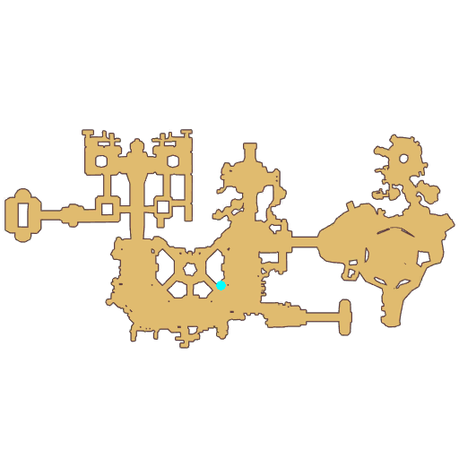

# Quest 6.0 Atmosphere Talk

- Id: 205290001
- Steps: 1
- Map: 76

## Steps

### Step 0
- StepName:  Long Night
- Map:  76
- Trace:  
- Type:  talk
- Content:  visit
- Visit NPC 803277, Loewe

- 
- Dialog: (311628)The days have been getting shorter and shorter in the town of Lighthalzen, ever since Rekenber Corporation built their laboratory.
- Dialog: (311629)Maybe it's because of all the gasses emitted from the laboratory obscuring the sky.
- Dialog: (311630)But maybe Rekenber Corporation can develop something that even replaces the sun.

