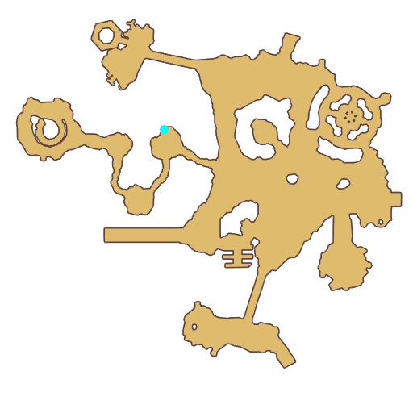
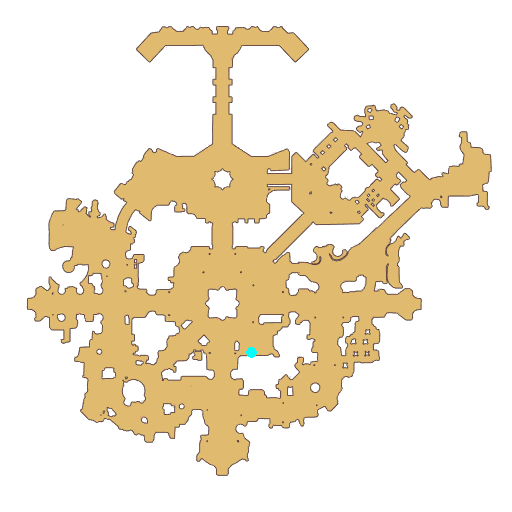

# Quest Wild Music

- Id: 21200001
- Steps: 3
- Map: 1, 5

## Steps

### Step 0
- StepName:  Wild Music
- Map:  5
- Trace:  
- Type:  branch
- Content:  visit
- Visit NPC 1131, Happy Vocal

- 
- Dialog: (1280)Erm, hmm, hello, adventurer! Do you want to rock with me?  - Options: Rock to what?
- Dialog: (1281)To this killer music! Come on, let's jam! - Options: What music?
- Dialog: (1282)Oh, sorry. I love rock music so much that I can talk about it all the time. I'm dancing to the music in my head. - Options: There's also a violin!
- Dialog: (1283)Oh yes, this violin was a gift from a [c][ffff00]Metaller[-][/c]. It's my treasure. A few days ago, I harmlessly told a [c][ffff00]Rocker[-][/c] to lose weight, and when I wasn't looking, he snapped one of my [c][ffff00]Violin Strings[-][/c]. But I won't hold it against him!
- Dialog: (1284)In the past, I actually loved the violin the most. I even held small concerts for all of my [c][ffff00]Rocker[-][/c] fans. But then I suddenly fell in love with rock n' roll. That wild passion is indescribable! - Options: Let me help you!
- Dialog: (1285)That would be great! I've heard that mean Rockers will drop [c][ffff00]Rocker Legs[-][/c]. [c][ffff00]Collect 5[-][/c] and take them to the [c][ffff00]General Trader[-][/c] in Prontera to get a complete [c][ffff00]Violin String[-][/c]! But those [c][ffff00]Rockers[-][/c] can be violent. I couldn't win in a fight with them. Can you help me teach them a lesson? - Options: No problem!

### Step 2
- StepName:  Wild Music
- Map:  1
- Trace:  
- Type:  branch
- Content:  visit
- Visit NPC 1046, Ingrid

- 
- Dialog: (1290)Hello, did you need something? - Options: Trade for Violin String
- Dialog: (1291)Perfect, I didn't have time to go collect Rocker Legs myself. Here, this is your [c][ffff00]Violin String[-][/c].

### Step 3
- StepName:  Wild Music
- Map:  5
- Trace:  
- Type:  branch
- Content:  visit
- Visit NPC 1131, Happy Vocal

- 
- Dialog: (1286)Wow, I'm touched! Thank you! I was worried I wasn't going to be able to explain what happened to the [c][ffff00]Metaller[-][/c]! He had this violin specially made for me because he didn't want it to go into disrepair once I fell in love with rock n' roll... - Options: Give Violin String
- Dialog: (1287)I don't know how to repay you! Come by when you have time, and I'll play some songs for you. I've heard that rock and violin go well together!
- Dialog: (1288)But I still love rock n' roll the most. Sometimes I can't even control myself. Lately I've been going crazy, I don't know what's wrong with me!
- Dialog: (1289)I'm not going to worry about it. I'm not going to restrain myself. You should bravely pursue what you love! The most important thing is being happy! Hmm, ha, I'm going to keep dancing, I'll see you later.

