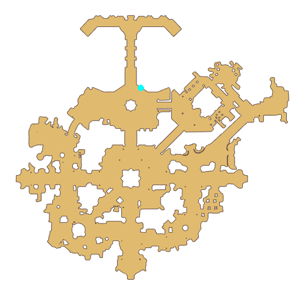

# Quest Be a Mentor

- Id: 391010001
- Steps: 1
- Map: 1

## Steps

### Step 0
- StepName:  Be a Mentor
- Map:  1
- Trace:  
- Type:  branch
- Content:  visit
- Visit NPC 6769, Terch

- 
- Dialog: (50086)Adventurer, please stay! Please allow me to give a brief introduction. My name is Terch, the mentor of the Adventurer's Guild. My job is mainly to guide the new adventurers.
- Dialog: (50087)But, there are too many people seeking to be adventurers recently. We are understaffed.
- Dialog: (50088)The president has decided to find some skilled adventurers as a set of trials. If you can pass my test, you can become a mentor to adventurers and help us guide newbies in your spare time.
- Dialog: (50089)But our requirements are also very strict. You must have a wealth of adventure experience and the necessary educational skills.
- Dialog: (50090)Of course, if you can be a mentor, you will also get generous rewards from the Adventurer's Guild.
- Dialog: (50091)Let me see, huh...

