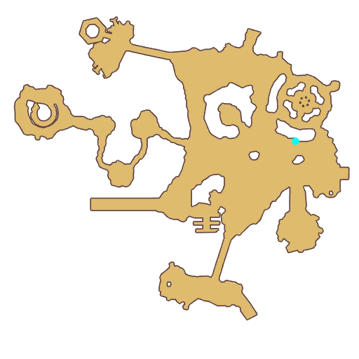

# Quest Candy Girl

- Id: 398300001
- Steps: 1
- Map: 5

## Steps

### Step 0
- StepName:  Candy Girl
- Map:  5
- Trace:  
- Type:  talk
- Content:  visit
- Visit NPC 7541, Barbara

- 
- Dialog: (304969)As for the legendary Rainbow Cake, I will make it by myself!
- Dialog: (304970)Adventurer, are you interested in dessert? - Options: Interested
- Dialog: (304971)The story happened during the founding of the Rune Kingdom. King Tristan wanted to celebrate the birth of the Rune Kingdom with a cake. He offered a reward in Prontera Square, who could make the best cake would earn the position of Royal Chef.
- Dialog: (304972)Many dessert masters took part in the contest bring all kinds of works - gold swirl cakes, Mastela fruit cakes... Famous delicacies from all over the land.
- Dialog: (304973)But a girl from West Gate used five local ingredients to make a fantastic dessert, Fairyland Cake, which enjoyed a great reputation. Her name is Orleans Jane, the first president of the Royal Cooking Association of the Rune Kingdom.
- Dialog: (304974)To commemorate this legendary cake, a fairyland cake making contest is held every year.
- Dialog: (304975)Fairyland cake challenge is a dream of every dessert, me also. Just as Orleans Jane, I came from the West Gate, but I met big troubles collecting ingredients. Can you help me? - Options: No problem.
- Dialog: (304976)Great. If you can find all the ingredients for making a fairyland cake, I'm sure I'll succeed! I'll give you the first taste! - Options: That's a deal!
- Dialog: (304977)It is said that there is a special plant named Gourmet Flower growing in a space where the delicious food materials are located. As long as you the gourmet flowers in the West Gate, you are not far away from those materials.

