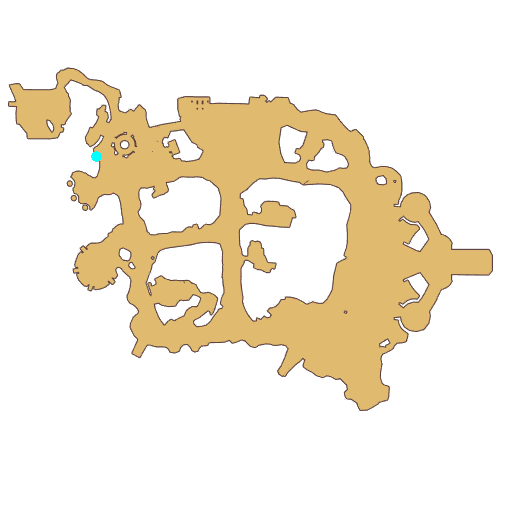

# Quest Point Allocation Guide

- Id: 400000001
- Steps: 13
- Map: 2
- Previous quest: [Trial 2](10003.md)

## Steps

### Step 0
- StepName:  Learn About Attributes
- Map:  2
- Trace:  Learn About Attributes
- Type:  guiding_task
- Content:  visit
- Visit NPC 1054, Vivinne

- 

### Step 1
- StepName:  Learn About Attributes
- Map:  2
- Trace:  Learn About Attributes
- Type:  guiding_task
- Content:  dialog
- Dialog: (83)[c][ffff00][PlayerName][-][/c], as you level up, you will gain Attributes which can make you stronger.

### Step 4
- StepName:  Learn About Attributes
- Map:  2
- Trace:  Learn About Attributes
- Type:  guiding_task
- Content:  visit
- Visit NPC 1054, Vivinne

- 
- Dialog: (85)The Attributes decide your development trend. Let me show you how to allocate them. - Options: OK

### Step 5
- StepName:  Learn About Attributes
- Map:  2
- Trace:  Learn About Attributes
- Type:  guiding_task
- Content:  guide

### Step 6
- StepName:  Learn About Attributes
- Map:  2
- Trace:  Learn About Attributes
- Type:  guiding_task
- Content:  guide

### Step 7
- StepName:  Learn About Attributes
- Map:  2
- Trace:  Learn About Attributes
- Type:  guiding_task
- Content:  guide

### Step 8
- StepName:  Learn About Attributes
- Map:  2
- Trace:  Learn About Attributes
- Type:  guiding_task
- Content:  guide

### Step 9
- StepName:  Learn About Attributes
- Map:  2
- Trace:  Learn About Attributes
- Type:  guiding_task
- Content:  guide

### Step 10
- StepName:  Learn About Attributes
- Map:  2
- Trace:  Learn About Attributes
- Type:  guiding_task
- Content:  guide

### Step 11
- StepName:  Learn About Attributes
- Map:  2
- Trace:  It's done! Continue to talk to Vivinne
- Type:  guiding_task
- Content:  visit
- Visit NPC 1054, Vivinne

- 

### Step 12
- StepName:  Learn About Attributes
- Map:  2
- Trace:  
- Type:  guiding_task
- Content:  dialog
- Dialog: (86)That's pretty easy, isn't it? A small matter like this shouldn't be a challenge for you ^_^
- Dialog: (87)Attributes will be reset each time you upgrade your job. Your Job Mentor will also give you development advice. Please feel free to use the points and make yourself stronger. - Options: I see

### Step 13
- StepName:  Learn About Attributes
- Map:  2
- Trace:  Continue talk to Vivinne
- Type:  guiding_task
- Content:  visit
- Visit NPC 1054, Vivinne

- 

### Step 14
- StepName:  Learn About Attributes
- Map:  2
- Trace:  
- Type:  guiding_task
- Content:  dialog
- Dialog: (84)I see that you've allocated some Attributes. You are indeed a brilliant kid. - Options: Thank you

