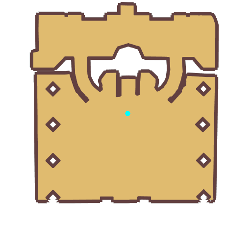

# Quest Allocate Skill Points

- Id: 400040001
- Steps: 2
- Map: 1001
- Next quest: [Job Upgrade](11110001.md)
- Next quest: [Job Upgrade](11120001.md)
- Next quest: [Job Upgrade](11130001.md)
- Next quest: [Job Upgrade](11140001.md)
- Next quest: [Job Upgrade](11150001.md)
- Next quest: [Job Upgrade](11160001.md)
- Next quest: [Point Allocation after Job-change](400070001.md)
- Previous quest: [Select Job](11500006.md)
- Previous quest: [20860002](20860002.md)

## Steps

### Step 0
- StepName:  About skill points
- Map:  1001
- Trace:  Learn Skills
- Type:  guiding_task
- Content:  visit
- Visit NPC 1024, Higgy Eez

- 
- Dialog: (2364)[c][ffff00]Skills[-][/c] are our most powerful abilities. If you want to become an outstanding adventurer, you need to master both combat techniques and survival skills. I'll teach you a few of the basics first, and once you're more experienced, you can come back and have me teach you more. - Options: Thank you

### Step 48
- StepName:  About skill points
- Map:  1001
- Trace:  Learn Skills
- Type:  guiding_task
- Content:  visit
- Visit NPC 1024, Higgy Eez

- 
- Dialog: (2365)As you go on adventures, you can also practice your [c][ffff00]job skills[-][/c]. That is how adventurers survive, and the best way for newcomers to grow. You can do it! - Options: Goodbye

