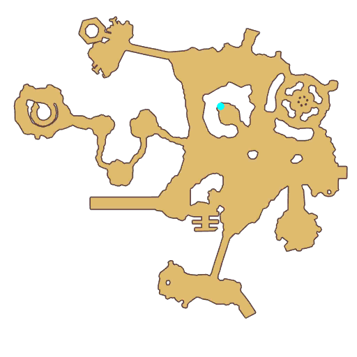

# Quest Demon King Morroc

- Id: 60004
- Steps: 13
- Map: 5
- Next quest: [Runemaster](60005.md)
- Previous quest: [Yimir Heart](60003.md)

## Steps

### Step 0
- StepName:  Demon King Morroc
- Map:  5
- Trace:  Talk to apprentice [c][ffff00][npcName][-][/c] under the tree
- Type:  acc_main
- Content:  visit
- Visit NPC 1414, Meble

- 
- Dialog: (96117)Don't be afraid, adventurer. These monsters love to hear me sing. 

### Step 2
- StepName:  Demon King Morroc
- Map:  5
- Trace:  Go talk to Meble
- Type:  acc_main
- Content:  visit
- Visit NPC 1414, Meble

- 
- Dialog: (96118)I like them. I'm sure you do, too.
- Dialog: (96119)So can you help me pick some bananas to give them? 

### Step 4
- StepName:  Demon King Morroc
- Map:  5
- Trace:  Collect [num] [c][ffff00][monsterName][-][/c] at the foot of the hills in the north
- Type:  acc_main
- Content:  collect

### Step 6
- StepName:  Demon King Morroc
- Map:  5
- Trace:  Feed Banana
- Type:  acc_main
- Content:  use

### Step 8
- StepName:  Demon King Morroc
- Map:  5
- Trace:  Feed Banana
- Type:  acc_main
- Content:  use

### Step 10
- StepName:  Demon King Morroc
- Map:  5
- Trace:  Feed Banana
- Type:  acc_main
- Content:  use

### Step 12
- StepName:  Demon King Morroc
- Map:  5
- Trace:  Feed Banana
- Type:  acc_main
- Content:  use

### Step 14
- StepName:  Demon King Morroc
- Map:  5
- Trace:  Feed Banana
- Type:  acc_main
- Content:  use

### Step 16
- StepName:  Demon King Morroc
- Map:  5
- Trace:  Demon King Morroc
- Type:  acc_main
- Content:  dialog
- Dialog: (96120)(It seems you missed one...)

### Step 24
- StepName:  Demon King Morroc
- Map:  5
- Trace:  Demon King Morroc
- Type:  acc_main
- Content:  dialog
- Dialog: (96121)Please, take a seat.

### Step 25
- StepName:  Demon King Morroc
- Map:  5
- Trace:  Sit to hear Meble telling a story
- Type:  acc_main
- Content:  use

### Step 27
- StepName:  Demon King Morroc
- Map:  5
- Trace:  Demon King Morroc
- Type:  acc_main
- Content:  dialog
- Dialog: (96122)The power of the Yimir's Heart Shardss summoned a threat from another world. [c][ffff00]Morroc, the Demon[-][/c].
- Dialog: (96123)In order to obtain this power, the Demon opened a Rift in time and space, and entered our world. 
- Dialog: (96124)It's said that the Demon had black wings and was covered in evil eyes. If an ordinary person locked gazes with the eyes, they could be possessed, or even die. Its arrival destroyed several small kingdoms. 
- Dialog: (96125)Faced with the Demonic powers, the joint forces were defeated in every battle. Even the Valkyries couldn't do anything. People began to pray for a hero to come save the world.

### Step 28
- StepName:  Demon King Morroc
- Map:  5
- Trace:  Talk to [c][ffff00][npcName][-][/c]
- Type:  acc_main
- Content:  visit
- Visit NPC 1067, Sphens

- 
- Dialog: (5089)You must believe the Savior will appear when we need him most.

