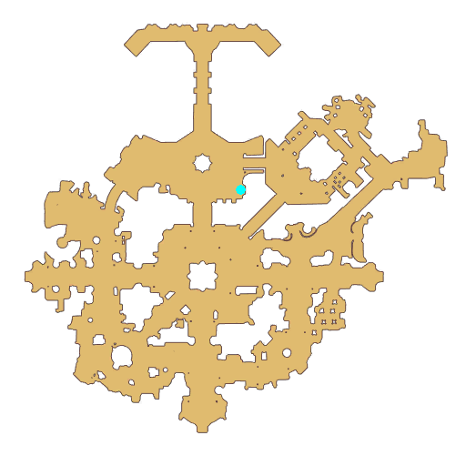

# Quest About Aeisr Monument

- Id: 600480001
- Steps: 1
- Map: 1

## Steps

### Step 0
- StepName:  About Aeisr Monument
- Map:  1
- Trace:  
- Type:  talk
- Content:  visit
- Visit NPC 6271, Mogore

- 
- Dialog: (86295)Within the nine realms supported by the World Tree, There are places Asgard has never laid its eyes on. One of these places is a beautiful forest called Svartalfheim.
- Dialog: (86296)Dwarves would rest, dance and tell storys around a magic slate that is their fountain of wisdom. This rune covered slate grants the dwarves infinite wisdom and profound knowledge.
- Dialog: (86297)During the first Ragnarok, the dwarven leader gave part of the slate to Odin in order to protect the world from total destruction. In the moment before his death, Odin entrusted this slate to a Valkyrie called Alvit.
- Dialog: (86298)A new world was finally created and gods gained incredible wisdom and knowledge from this slate. This slate also got a new name: Aeisr Monument.
- Dialog: (86299)In order to acquire Nibelungen Shards, I decided to rely on adventurers. But they are too weak in our eyes.
- Dialog: (86300)We decided to help those humans who have potential by granting them Shards of Aeisr Monument and the power to rival the Epic Spirit along with it.
- Dialog: (86301)Our purpose is to acquire Nibelungen Shards and prevent another Ragnarok from happening.
- Dialog: (86302)Adventurer, do you want the power of Aeisr Monument?

