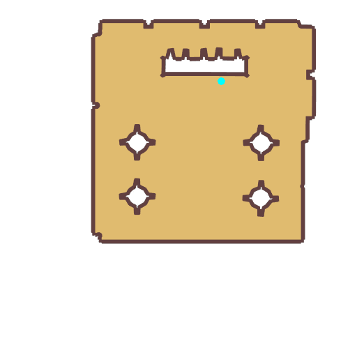

# Quest About the Cuisine Association

- Id: 600890001
- Steps: 1
- Map: 1016

## Steps

### Step 0
- StepName:  About the Cuisine Association
- Map:  1016
- Trace:  
- Type:  talk
- Content:  visit
- Visit NPC 6448, Sisowath

- 
- Dialog: (87839)The Cuisine Association is short for Prontera Royal Cuisine Association.
- Dialog: (87840)Dedicated to the development of better tasting and healthier food, as well as the training of capable cooks. The Prontera Royal Cuisine Association was established with the permission of Emperor Tristan.
- Dialog: (87841)With the Royal master chef Kuzzo as its first president, the Royal Cuisine Association has become more and more influential over the centuries.
- Dialog: (87842)Its subsidiaries include the Izlude Cuisine Association, Geffen Magic Cooking College, Morroc Cuisine Association, Payon Cuisine Association, Alberta Aquatic Association and Al De Baran Food Appraisal Committee, which are founded to study distinctive cuisines on different regions.
- Dialog: (87843)Masters of cooking unlock the potential of various food ingredients and turn them into delicacies.
- Dialog: (87844)Varying based on ingredients, food may provide adventurers with benefits, such as healing and removing poison. That's why cooking is very popular in Midgards, and why the Prontera Royal Cuisine Association could have royal support in its fast development.

