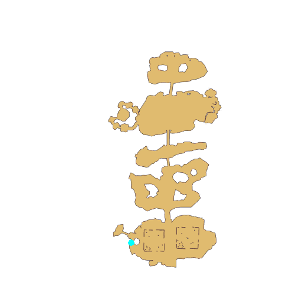

# Quest Latest News

- Id: 601170001
- Steps: 1
- Map: 42

## Steps

### Step 0
- StepName:  Latest News
- Map:  42
- Trace:  
- Type:  talk
- Content:  visit
- Visit NPC 6541, Jacquerie

- 
- Dialog: (88205)Harmless Porings and Fabres once inhabited the area around the north gate of Prontera, just like they did around the south gate.
- Dialog: (88206)Occationally, They might cause some minor trouble for people around the north gate, but nothing serious.
- Dialog: (88207)But now their change is so dramatic that I think they've mutated into another species.
- Dialog: (88208)So the Monster Research Organization sends people here to research these monsters and the effects they have.

