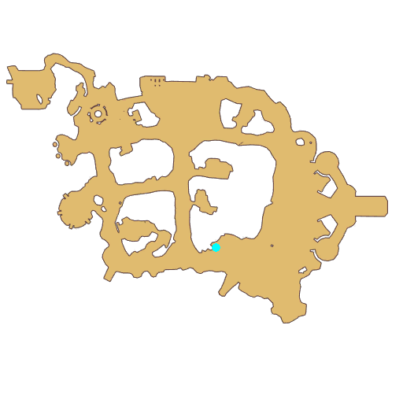

# Quest Blooming Life

- Id: 90000002
- Steps: 11
- Map: 2

## Steps

### Step 0
- StepName:  Blooming Life
- Map:  2
- Trace:  
- Type:  branch
- Content:  visit
- Visit NPC 1152, Will

- 
- Dialog: (3433)Adventurer, I once raised a cute Fabre named Ke.

### Step 2
- StepName:  Blooming Life
- Map:  2
- Trace:  Ke is so lovely!
- Type:  branch
- Content:  visit
- Visit NPC 1152, Will

- 
- Dialog: (3434)Ke was so lovely!
- Dialog: (3435)…
- Dialog: (3436)Yeah, I watched it grow up day by day, chewing the green grasses. I fed it a lot everyday.

### Step 4
- StepName:  Blooming Life
- Map:  2
- Trace:  Collect [num] grass for Ke in the vicinity
- Type:  branch
- Content:  collect

### Step 5
- StepName:  Blooming Life
- Map:  2
- Trace:  Feed Ke till it's full
- Type:  branch
- Content:  visit
- Visit NPC 1153, Ke

- 
- Dialog: (3437)Ke, time to eat... - Options: Yummy food!
- Dialog: (3438)…

### Step 6
- StepName:  Blooming Life
- Map:  2
- Trace:  What happened next
- Type:  branch
- Content:  visit
- Visit NPC 1152, Will

- 
- Dialog: (3439)We've had great times together. Ke and I have become close friends.
- Dialog: (3440)…

### Step 7
- StepName:  Blooming Life
- Map:  2
- Trace:  
- Type:  branch
- Content:  dialog
- Dialog: (3441)But one day, Ke suddenly stopped moving and communicating with me. It hid itself away. I was so worried and wondered if Ke was sick!

### Step 11
- StepName:  Blooming Life
- Map:  2
- Trace:  
- Type:  branch
- Content:  dialog
- Dialog: (3442)What's wrong with Ke?
- Dialog: (3443)I don't know. There were monsters coming to attack Ke everyday. All I could do was to protect Ke. - Options: Protect Ke!

### Step 13
- StepName:  Blooming Life
- Map:  2
- Trace:  Protect Ke and defeat the [c][ffff00]Curious Hornets[-][/c]
- Type:  branch
- Content:  kill

### Step 14
- StepName:  Blooming Life
- Map:  2
- Trace:  Protect Ke
- Type:  branch
- Content:  visit
- Visit NPC 1152, Will

- 
- Dialog: (3445)What happened?
- Dialog: (3446)I went to the experts at [c][ffff00]Monster Bio Lab[-][/c]. They told me Ke was going to evolve and the sky would be its new home.

### Step 17
- StepName:  Blooming Life
- Map:  2
- Trace:  Beautiful Transformation
- Type:  branch
- Content:  dialog
- Dialog: (3447)I knew what it meant, and I also knew I couldn't keep Ke trapped to the land any longer. It should fly high in the sky. Though I hate to leave Ke, I'm happy for it. I know it's the right thing to do.
- Dialog: (3453)…
- Dialog: (3448)Ke, I didn't know you could be so beautiful!
- Dialog: (3449)Go find your new home, Ke. Farewell.
- Dialog: (3456)…
- Dialog: (3450)Ke truly is beautiful. Goodbye, Ke, my friend.

### Step 21
- StepName:  Blooming Life
- Map:  2
- Trace:  Beautiful Transformation
- Type:  branch
- Content:  visit
- Visit NPC 1152, Will

- 
- Dialog: (3451)Thank you for sharing this part of my life's story.
- Dialog: (3452)Thank you for listening.

