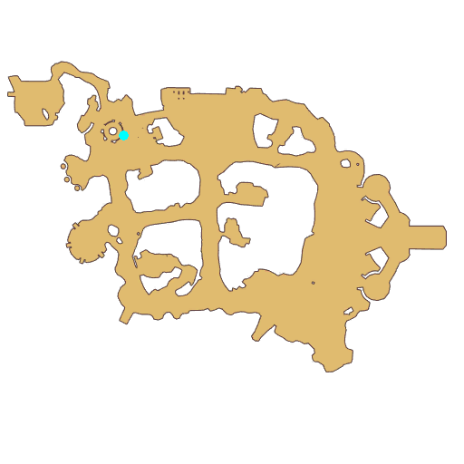

# Quest Lucky Four-leaf Clover

- Id: 99030001
- Steps: 13
- Map: 2
- Next quest: [Lucky Four-leaf Clover](99030002.md)

## Steps

### Step 0
- StepName:  Lucky Four-leaf Clover
- Map:  2
- Trace:  
- Type:  branch
- Content:  visit
- Visit NPC 1381, St Patrick

- 
- Dialog: (3854)My child, I arrived in this land with mercy and love. I'm a missionary.
- Dialog: (3855)In this magical place, I discovered a [c][ffff00]Four-leaf Clover[-][/c], which is a token of good fortune. I'm sure adventurers are familiar with this.
- Dialog: (3856)Yeah. I found one a long time ago. I used to carry it with me every day.
- Dialog: (3857)Please bring me a [c][ffff00]Four-leaf Clover[-][/c] and I'll bless you, kind adventurer. - Options: Alright.

### Step 1
- StepName:  Lucky Four-leaf Clover
- Map:  2
- Trace:  Kill the Lunatics near the south gate and bring 1 Four-Leaf Clover to St Patrick
- Type:  branch
- Content:  gather

### Step 2
- StepName:  Lucky Four-leaf Clover
- Map:  2
- Trace:  Give the Four-Leaf Clover to St Patrick
- Type:  branch
- Content:  visit
- Visit NPC 1381, St Patrick

- 
- Dialog: (3858)My child, what you might not know is that there's a magic that can infuse the Four-leaf Clover's good fortune into your life.
- Dialog: (3859)Oh, really? I must learn this! Please teach me how to do it.
- Dialog: (3959)As the name suggests, the Lucky Four-leaf Clover has four leaves, each of them containing a secret.
- Dialog: (3960)Are you ready for the Four-leaf Clover challenge? - Options: You bet!
- Dialog: (3961)Now you are to complete the first leaf's task; [c][ffff00]Glory[-][/c].
- Dialog: (3861)I'll emulate a horrible monster from a thousand years ago. Please fight for your glory.

### Step 12
- StepName:  Lucky Four-leaf Clover
- Map:  2
- Trace:  Defeat Shadow of Baphomet
- Type:  branch
- Content:  kill

### Step 13
- StepName:  Lucky Four-leaf Clover
- Map:  2
- Trace:  Accept the quest for the 2nd one
- Type:  branch
- Content:  visit
- Visit NPC 1381, St Patrick

- 
- Dialog: (3962)The Four-leaf Clover has witnessed your glory.
- Dialog: (3963)Next is the second leaf's task; [c][ffff00]Wealth[-][/c]. I need a coin from a merchant.
- Dialog: (3964)I'll give you a little help. Please bring it back quickly. 

### Step 23
- StepName:  Lucky Four-leaf Clover
- Map:  2
- Trace:  Ask Alin for a Merchant's coin
- Type:  branch
- Content:  visit
- Visit NPC 1042, Alin

- 
- Dialog: (3864)What a strange request! I have a few coins from a Morroc merchant. Here you are.
- Dialog: (3865)Thank you, [c][ffff00]Mrs. Alin[-][/c].
- Dialog: (3866)Mrs.? Don't assume I'm older than you?

### Step 24
- StepName:  Lucky Four-leaf Clover
- Map:  2
- Trace:  Give the money to St Patrick
- Type:  branch
- Content:  visit
- Visit NPC 1381, St Patrick

- 
- Dialog: (3965)Not bad. It didn't take you long.
- Dialog: (3966)Now let's move on to the third leaf's task.

### Step 25
- StepName:  Lucky Four-leaf Clover
- Map:  2
- Trace:  Prepare for the 3rd one's quest
- Type:  branch
- Content:  visit
- Visit NPC 1381, St Patrick

- 
- Dialog: (3868)Please touch the Four-leaf Clover and close your eyes while thinking about someone you deeply love.

### Step 26
- StepName:  Lucky Four-leaf Clover
- Map:  2
- Trace:  
- Type:  branch
- Content:  question

### Step 28
- StepName:  Lucky Four-leaf Clover
- Map:  2
- Trace:  Prepare for the 4th one's quest
- Type:  branch
- Content:  visit
- Visit NPC 1381, St Patrick

- 
- Dialog: (3967)I once had someone living in my heart… 
- Dialog: (3968)Okay. The fourth leaf's task is health.
- Dialog: (3870)I guess you are tired already, so I'll help you finish this task.

### Step 38
- StepName:  Lucky Four-leaf Clover
- Map:  2
- Trace:  Fully Prepared
- Type:  branch
- Content:  visit
- Visit NPC 1381, St Patrick

- 
- Dialog: (3871)Good. The Four-leaf Clover is responding. Please join me in the Gloria.

### Step 40
- StepName:  Lucky Four-leaf Clover
- Map:  2
- Trace:  
- Type:  branch
- Content:  dialog
- Visit NPC 1381, St Patrick

- 
- Dialog: (3872)One leaf brings Glory.
- Dialog: (3873)One brings Wealth.
- Dialog: (3874)One brings Love.
- Dialog: (3875)And one brings Health.
- Dialog: (3876)Oh the Four-leaf Clover! You also have these four abilities.

### Step 41
- StepName:  Lucky Four-leaf Clover
- Map:  2
- Trace:  
- Type:  branch
- Content:  question

