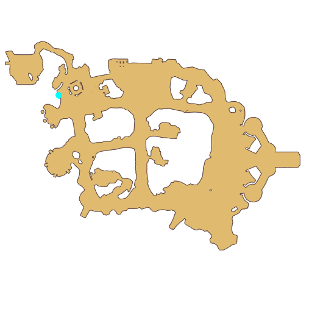

# Quest Eggshell

- Id: 99040001
- Steps: 4
- Map: 2

## Steps

### Step 0
- StepName:  Eggshell
- Map:  2
- Trace:  
- Type:  branch
- Content:  visit
- Visit NPC 1382, Chris

- 
- Dialog: (3897)Good timing, adventurer. I'm [c][ffff00]Chris[-][/c], a guard stationed in the country of Prontera.
- Dialog: (3898)Pleased to meet you, Mr. Guard.
- Dialog: (3899)I have a favor to ask. Recently the monsters by the South Gate have become more and more unstable. Please tell [c][ffff00]Poya[-][/c] to be careful even during the entrance exam. Don't be too strict. - Options: OK

### Step 1
- StepName:  Eggshell
- Map:  2
- Trace:  Tell Poya to take good care of the newbies
- Type:  branch
- Content:  visit
- Visit NPC 1054, Vivinne

- 
- Dialog: (3901)Got it. You're not the first man to deliver a message for [c][ffff00]Chris[-][/c]. He should make time to come by himself.
- Dialog: (3902)For the newcomers' safety, we've handed out an Eggshell Hat to everyone. It's easy for him to say this, as now we're in an awful shortage of [c][ffff00]Eden Team Eggshells[-][/c]. We barely have any left.
- Dialog: (3903)… I have one. I hope it helps.
- Dialog: (3904)Unfortunately, it doesn't. All the Eden Team Eggshells are disinfected and brand new. Yours is so worn out. How can I use it?
- Dialog: (3905)Ah! Our Eden Team helped a Morroc caravan in the past and the Eggshells are made over there. Could you help me buy some from them?
- Dialog: (3906)Adventurers don't make much money…
- Dialog: (3907)Only five. It won't cost you a fortune. It will be your membership fee.

### Step 2
- StepName:  Eggshell
- Map:  2
- Trace:  Buy 5 Eggshells unwillingly from the caravan at the south gate
- Type:  branch
- Content:  visit
- Visit NPC 1044, Hadnall

- 
- Dialog: (3908)It's you! Lately, our Morroc caravan has been doing business all over the place. Thank you so much for Eden Team's help.
- Dialog: (3909)It's our duty.
- Dialog: (3910)Tell me. How can I help you? I'd go through fire and water for you!
- Dialog: (3911)Not that serious… You don't have to go through fire and water. I want to buy five [c][ffff00]Eggshells[-][/c].
- Dialog: (3912)Eggshell hats? Haha… Eggshells? Haha.
- Dialog: (3913)Eggshells, we have plenty of. Free for you. Take 50 to begin.
- Dialog: (3914)Ah… So heavy… Hadnall, thanks a million!

### Step 3
- StepName:  Eggshell
- Map:  2
- Trace:  Give the Eggshell to Poya
- Type:  branch
- Content:  visit
- Visit NPC 1054, Vivinne

- 
- Dialog: (3916)This is a ton of Eggshells! Good. You've completed the task beautifully!
- Dialog: (3917)Now I can give out Eggshells as needed again.

