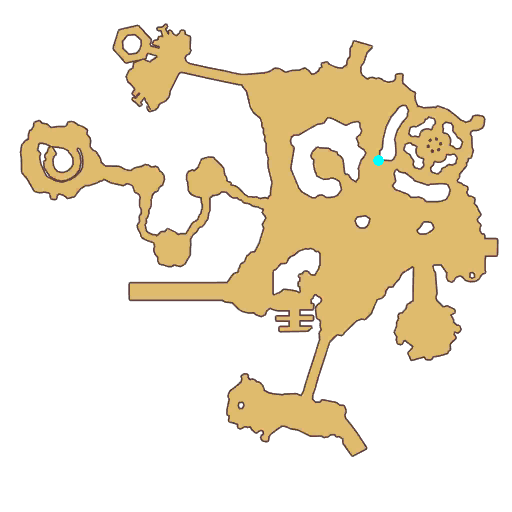

# Quest Rainbow Garden

- Id: 99150001
- Steps: 11
- Map: 5

## Steps

### Step 0
- StepName:  Rainbow Garden
- Map:  5
- Trace:  
- Type:  scene
- Content:  visit
- Visit NPC 1398, Oscar Wilde

- 
- Dialog: (96366)Before the Demon came to the mainland, one could often see colored lights in the Palm Gardens.
- Dialog: (96367)It is said that the plants in the gardens come from the Eclage Plains. 
- Dialog: (96368)The power of love can make these amazing plants grow, while the remnants of the Demon make them wither. 
- Dialog: (96369)Adventurer, take someone important to you with you and touch the plants.
- Dialog: (96370)The red light of Eclage will endow you with courage.

### Step 1
- StepName:  Rainbow Garden
- Map:  5
- Trace:  Try to touch the plants in the garden
- Type:  scene
- Content:  use

### Step 4
- StepName:  Rainbow Garden
- Map:  5
- Trace:  Try to touch the plants in the garden
- Type:  scene
- Content:  use

### Step 7
- StepName:  Rainbow Garden
- Map:  5
- Trace:  Try to touch the plants in the garden
- Type:  scene
- Content:  use

### Step 10
- StepName:  Rainbow Garden
- Map:  5
- Trace:  Try to touch the plants in the garden
- Type:  scene
- Content:  use

### Step 13
- StepName:  Rainbow Garden
- Map:  5
- Trace:  Talk to the disappointed Oscar
- Type:  scene
- Content:  visit
- Visit NPC 1398, Oscar Wilde

- 
- Dialog: (96372)Don't give up, young one. I'm sure that the felt it.
- Dialog: (96373)Next, let's talk about something a bit more serious. 
- Dialog: (96374)During that invasion 1,000 years ago, an dark and demented shadow from another world infiltrated the Palm Gardens.
- Dialog: (96375)Adventurer, it is time to destroy those demons. 
- Dialog: (96376)They are in the Gardens. Please find them, then destroy them! 

### Step 14
- StepName:  Rainbow Garden
- Map:  5
- Trace:  Find the demon in the garden
- Type:  scene
- Content:  use

### Step 21
- StepName:  Rainbow Garden
- Map:  5
- Trace:  The strange plant starts to shine
- Type:  scene
- Content:  dialog
- Dialog: (96377)The plants emit a special light. 

### Step 25
- StepName:  Rainbow Garden
- Map:  5
- Trace:  The power of demon is weakened
- Type:  scene
- Content:  dialog
- Dialog: (96378)Affected by the light, the demon's power has been wiped away. 

### Step 30
- StepName:  Rainbow Garden
- Map:  5
- Trace:  Defeat the Alien Nightmare.
- Type:  scene
- Content:  kill

### Step 32
- StepName:  Rainbow Garden
- Map:  5
- Trace:  Talk to Oscar
- Type:  scene
- Content:  visit
- Visit NPC 1398, Oscar Wilde

- 
- Dialog: (96379)You mustn't underestimate this otherworldly power. You are very brave. 
- Dialog: (96380)The light has returned to the Gardens. It blesses you.

