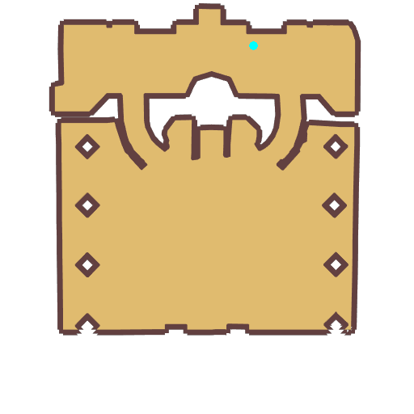

# Quest Statue of the King

- Id: 99150021
- Steps: 1
- Map: 1001

## Steps

### Step 0
- StepName:  Statue of the King
- Map:  1001
- Trace:  
- Type:  scene
- Content:  visit
- Visit NPC 1514, Purnell

- 
- Dialog: (96423)Excellent. Every new adventurer will learn about things here from Purnell.
- Dialog: (96424)After Odin the Allfather obtained the rune's wisdom, he gave some of his strength to humans. But after the Twilight of the Gods, Odin could no longer protect humanity.
- Dialog: (96425)All adventurers who come here vow to take up the task of protecting humanity. 
- Dialog: (96426)I'm sure you're the same, child. 

