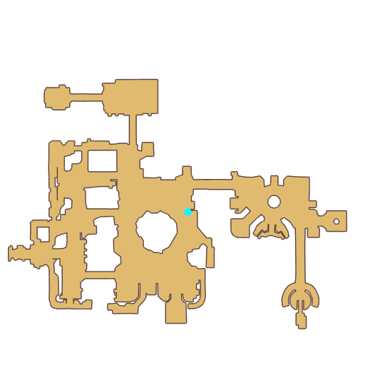

# Quest Izlude side quest

- Id: 99160104
- Steps: 3
- Map: 7
- Previous quest: [Izlude side quest](99160101.md)

## Steps

### Step 0
- StepName:  Silent Koe
- Map:  7
- Trace:  
- Type:  branch
- Content:  visit
- Visit NPC 1674, Weyle

- 
- Dialog: (131276)Koe is at the dock, looking at the sea..

### Step 1
- StepName:  Silent Koe
- Map:  7
- Trace:  Talk to [c][ffff00][npcName][-][/c]
- Type:  branch
- Content:  visit
- Visit NPC 1668, Silent Koe

- 
- Dialog: (131247)Hm? Do you need something ? - Options: {I'm investigating,12},{Nothing...,11}

### Step 3
- StepName:  Silent Koe
- Map:  7
- Trace:  Talk to [c][ffff00][npcName][-][/c]
- Type:  branch
- Content:  visit
- Visit NPC 1668, Silent Koe

- 
- Dialog: (131249)Whisper? I've never heard about that. - Options: Anything strange? 
- Dialog: (131250)You mean something strange recently? No, well... - Options: Well?
- Dialog: (131251)When I was coming back home with my brother, we saw a white sheet fluttering near the shore, so we picked it up and brought it back.
- Dialog: (131252)I figured it must belong to the girl from the inn, so I picked it up and figured I would wash it for her.
- Dialog: (131253)It was too late at the time. I don't know if she came to take it back or not.  - Options: You didn't return it to her yourself?
- Dialog: (131254)Hmph, no! My brother says girls have to remain aloof. - Options: So that's what happened...

