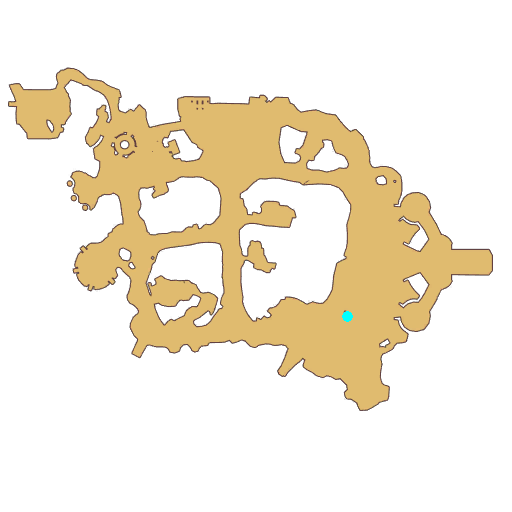

# Quest Showdown Time

- Id: 99190002
- Steps: 5
- Map: 2
- Next quest: [Eden Team Turban Blueprint](99200001.md)

## Steps

### Step 0
- StepName:  Showdown Time
- Map:  2
- Trace:  
- Type:  branch
- Content:  visit
- Visit NPC 3282, Seyren Windsor

- 

### Step 2
- StepName:  Showdown Time
- Map:  2
- Trace:  
- Type:  branch
- Content:  visit
- Visit NPC 3282, Seyren Windsor

- 
- Dialog: (8642)Ah! You scared me! I might have fallen asleep...
- Dialog: (8643)What? A novice? That's unfortunate! I'm not interested in talking to a squirt like you!
- Dialog: (8644)Come see me when you're officially part of the Adventurer's Guild. I'm going back to sleep.

### Step 3
- StepName:  Showdown Time
- Map:  2
- Trace:  
- Type:  branch
- Content:  visit
- Visit NPC 3282, Seyren Windsor

- 
- Dialog: (8645)Has an adventurer finally noticed me?
- Dialog: (8646)This big fellow behind me needs some Apple Juice. If you can bring me 200 bottles of Apple Juice, Then I might have more things to talk to you about. 

### Step 4
- StepName:  Showdown Time
- Map:  2
- Trace:  
- Type:  branch
- Content:  visit
- Visit NPC 3282, Seyren Windsor

- 
- Dialog: (8647)Would you get me 200 bottles of Apple Juice? - Options: {Of course,2},{No way,7}

### Step 22
- StepName:  Showdown Time
- Map:  2
- Trace:  
- Type:  branch
- Content:  dialog
- Dialog: (9148)That's too bad, you don't have enough Apple Juice!

