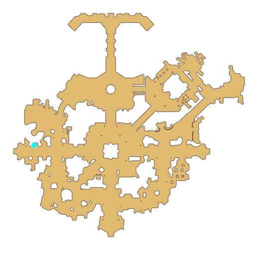

# Quest Overwhelming Fragrance

- Id: 99210001
- Steps: 8
- Map: 1, 0, 6

## Steps

### Step 0
- StepName:  Overwhelming Fragrance
- Map:  1
- Trace:  
- Type:  branch
- Content:  visit
- Visit NPC 3287, Jacques Cavallier

- 
- Dialog: (8707)Oh... Are you a young person who actually has taste?

### Step 2
- StepName:  Overwhelming Fragrance
- Map:  1
- Trace:  
- Type:  branch
- Content:  visit
- Visit NPC 3287, Jacques Cavallier

- 
- Dialog: (8709)I can smell the Jellopys you have on you. Would you give them to me? - Options: {Take out a Jellopy Crystal,4},{Refuse,6}

### Step 5
- StepName:  Overwhelming Fragrance
- Map:  1
- Trace:  
- Type:  branch
- Content:  visit
- Visit NPC 3287, Jacques Cavallier

- 
- Dialog: (8711)55 years ago, I discovered that Spice and Alcohol could be used to make perfume. Now, Lots of people know how to make it. 
- Dialog: (8712)But there are some things that still make me angry. Those merchants have the worst taste! They use whatever bottles they have on hand to sell perfume all over.
- Dialog: (8713)It's terrible! Those bottles are so ugly! They trample the dignity of good perfume!
- Dialog: (8714)To me, only exquisite bottles and with specially-mixed spices can be called true perfume. Those merchants don't understand at all!
- Dialog: (8715)But I think you might be different. I've decided to mix a perfume just for you.
- Dialog: (8716)So, please get me some more Jellopys. 10 should be enough.

### Step 6
- StepName:  Overwhelming Fragrance
- Map:  0
- Trace:  Bring 10 Jellopys to Cavallier
- Type:  branch
- Content:  item

### Step 8
- StepName:  Overwhelming Fragrance
- Map:  1
- Trace:  That's enough, give the Jellopy to Cavallier
- Type:  branch
- Content:  visit
- Visit NPC 3287, Jacques Cavallier

- 
- Dialog: (8775)That was fast, adventurer! Let me see the materials.

### Step 11
- StepName:  Overwhelming Fragrance
- Map:  1
- Trace:  
- Type:  branch
- Content:  dialog
- Dialog: (8717)Mhm, that's just the right amount. - Options: I look forward to it.
- Dialog: (8718)Don't be so anxious. I haven't got to the most important part. The Jellopys were just for me to make a bottle to fit the perfume in.

### Step 13
- StepName:  Overwhelming Fragrance
- Map:  1
- Trace:  
- Type:  branch
- Content:  visit
- Visit NPC 3287, Jacques Cavallier

- 
- Dialog: (8719)The real ingredient of true perfume is Mandragora. 
- Dialog: (8720)Yes, it is rare. I often ask adventurers going to the Northern Forest to bring me some Mandragora.
- Dialog: (8721)Can you bring me back some Mandragora? - Options: {Yes,11},{I'm scared,12}

### Step 14
- StepName:  Overwhelming Fragrance
- Map:  6
- Trace:  Bring 1 Mandragora to Cavallier
- Type:  branch
- Content:  item

