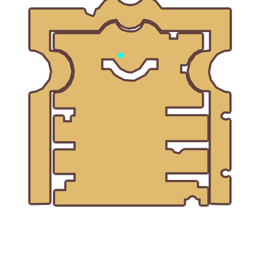

# Quest Henry Norris

- Id: 99270001
- Steps: 1
- Map: 1013

## Steps

### Step 0
- StepName:  The curator?
- Map:  1013
- Trace:  
- Type:  talk
- Content:  visit
- Visit NPC 3307, Henry Norris

- 
- Dialog: (9202)The librarian? I haven't seen him for a long time. Several months ago, he excitedly told me he had finally made progress on a secret he'd been studying for years.
- Dialog: (9203)A few days later, he went to Izlude to see some Mages that were experienced with time magic. He left a letter behind when he went.
- Dialog: (9204)He said that Faulkner would take over management of the library, and not to worry about him. But what was strange was that the guards never saw him leave Geffen...

