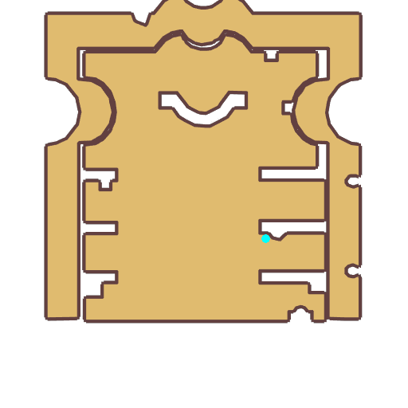

# Quest Old Wynn

- Id: 99280001
- Steps: 1
- Map: 1013

## Steps

### Step 0
- StepName:  Luna Library
- Map:  1013
- Trace:  
- Type:  talk
- Content:  visit
- Visit NPC 3309, Old Wynn

- 
- Dialog: (9207)Old Wynn knows the most about the library. Legend says that this place was first created by the members of the highest magic council, even before Geffen existed. All of the ancient text here are treasures that even the sages of Yuno could hardly wait to read.
- Dialog: (9208)Time passed, and as the city of Geffen was built, the library was moved into Geffen Tower. Those mysterious ancient texts contain unparalleled power. Even the monsters in the dungeon don't dare approach. 
- Dialog: (9209)Yes, You heard correctly. Not only do those mysterious texts contain secrets mortals can't comprehend, They also possess powerful magical radiation that keeps Wraiths away.

