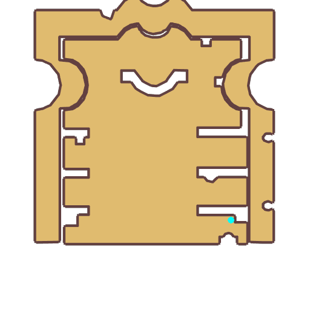

# Quest Bhatia

- Id: 99290001
- Steps: 1
- Map: 1013

## Steps

### Step 0
- StepName:  About Manah Power
- Map:  1013
- Trace:  
- Type:  talk
- Content:  visit
- Visit NPC 3311, Bhatia

- 
- Dialog: (9212)Magic has existed since the birth of the world. Magic is a natural elemental power in this world. If humans hope to master and control this power, they must continually interact with elements, and use incantations and runes to stimulate elemental power. 
- Dialog: (9213)But legend has it that only those who have come into contact with the divine power of Mana can maximize their ability to control elements, and can unleash elemental power even without incantations. 
- Dialog: (9214)The secret of the divine power of Mana is contained within Geffen. The closer one gets to the divine power of Mana, the easier it is to obtain magic power. The stories passed among people has created Geffen's prosperity.

