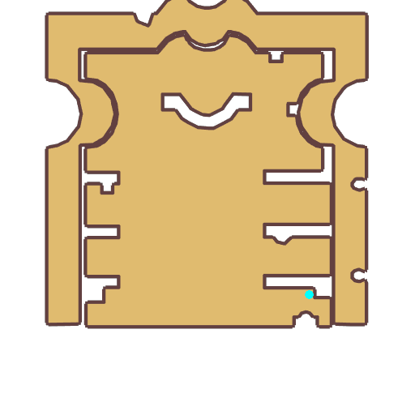

# Quest Bhatia

- Id: 99290002
- Steps: 1
- Map: 1013

## Steps

### Step 0
- StepName:  Bhatia's Discovery
- Map:  1013
- Trace:  
- Type:  talk
- Content:  visit
- Visit NPC 3311, Bhatia

- 
- Dialog: (9215)Legend says that long, Long ago, the War of the Gods broke out. During the war, the powerful Trolls were defeated, and the earliest troll ancestor was eliminated by the gods. Before he died, his heart split into pieces and was scattered across the land. Those who came after referred to it as the Heart of Yimir. 
- Dialog: (9216)Oh the shards of his heart, one shard contained a small amount of the troll's will, and had shards of an ancient magical incantation formed after the troll's blood had congealed. If this shard has a certain connection to Geffen, it might be the secret to unlocking the divine power of Mana. 
- Dialog: (9217)But an even more terrifying thing has been going on in my mind. I have been wondering if the secret of the Geffen Dungeon is related to this special shard?

