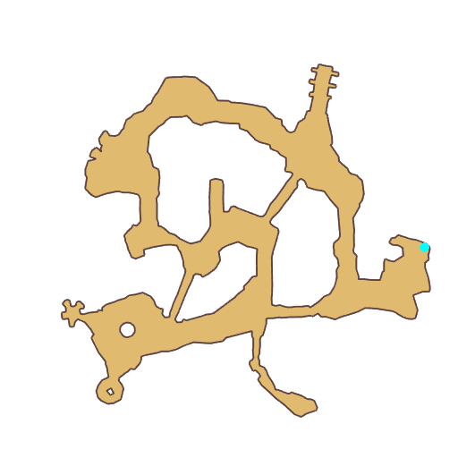

# Quest Ultimate Fight Club

- Id: 99511101
- Steps: 6
- Map: 11

## Steps

### Step 0
- StepName:  Freeman
- Map:  11
- Trace:  
- Type:  acc_satisfaction
- Content:  visit
- Visit NPC 4279, Freeman

- 
- Dialog: (81739)The life here is so boring... I can't believe I have been sent here on a mission... - Options: {Listen more,2},{I'm too busy,3}

### Step 2
- StepName:  Freeman
- Map:  11
- Trace:  
- Type:  acc_satisfaction
- Content:  dialog
- Dialog: (81740)A while ago, the seal at the bottom of the sea appeared loose. The leak of a large amount of energy has caused panic among the people.
- Dialog: (81741)The state council has decided to assign an elite unit to the underwater world to guard against any uncertain hidden threats.
- Dialog: (81742)As you know, Monster-related incidents are taking place all over the kingdom. Very few of the King's guards can be dispatched.
- Dialog: (81743)The council has to seek help from our Ultimate Fight Club. This is not why the club was founded but I don't think we have reasons to say no.
- Dialog: (81744)I double as an honorable member of the Ultimate Fight Club.

### Step 3
- StepName:  Freeman
- Map:  11
- Trace:  
- Type:  acc_satisfaction
- Content:  visit
- Visit NPC 4279, Freeman

- 
- Dialog: (81745)Adventurer, After the thorough cleansing, the underwater world is calm and stable now. However, a smooth and steady life is boring for me.
- Dialog: (81746)I haven't practiced with anyone for a long time. How upsetting! I'm afraid I'll lose all my combat skills if I can't find any worthy rival soon. I can't stand this.
- Dialog: (81747)No matter what, people only respect the able!
- Dialog: (81748)Adventurer, do you have the courage to be my rival? - Options: {Accept the challenge,4},{Turn it down cowardly,5}

### Step 5
- StepName:  Freeman
- Map:  11
- Trace:  
- Type:  acc_satisfaction
- Content:  dialog
- Dialog: (81750)Your courage has proved you are not a coward. But to be my rival, You must mentally prepare yourself well.
- Dialog: (81751)Even my simplest moves have astonishing strength. If you are not agile enough, You won't be able to keep a big enough distance from me when I strike. Then this combat will be meaningless because you have no chance of winning. - Options: Bring it

### Step 6
- StepName:  Freeman
- Map:  11
- Trace:  
- Type:  acc_satisfaction
- Content:  raid

### Step 7
- StepName:  Freeman
- Map:  11
- Trace:  
- Type:  acc_satisfaction
- Content:  visit
- Visit NPC 4279, Freeman

- 
- Dialog: (81754)What a great fight! I believe you will earn people's respect with your strength.

